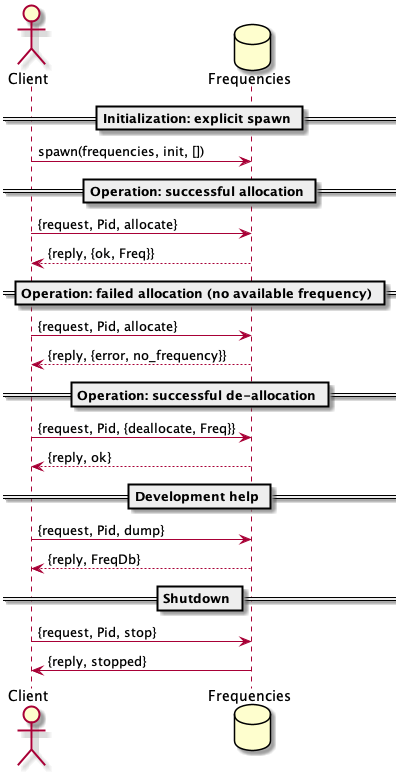
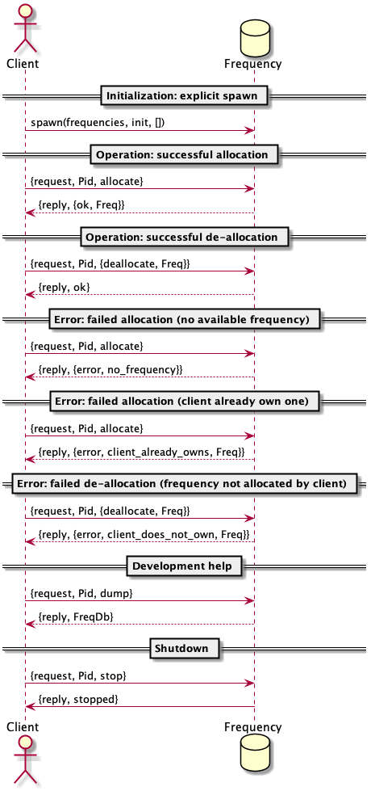

===============================
Exercice 3 - A Frequency Server
===============================

:Home page: https://github.com/pierre-rouleau/trying-erlang
:Time-stamp: <2020-07-08 15:34:44, updated by Pierre Rouleau>

This page describes work related to the `exercise 3`_, the first exercise of the
second week of the course `Concurrent Programming in Erlang`_.

.. _exercise 3: https://www.futurelearn.com/courses/concurrent-programming-erlang/3/steps/488342
.. _Concurrent Programming in Erlang: https://www.futurelearn.com/courses/concurrent-programming-erlang/

.. contents::  **Table Of Contents**
.. sectnum::

..
   -----------------------------------------------------------------------------

Setting Up My Working Environment
=================================

Before getting further, I wanted to setup a working Environment for Erlang on
my macOS system.  So I did the following:

#. I captured some of the information I have been gathering on Erlang inside a
   separate GitHub project: about-erlang_.  I am using, like here,
   reStructuredText markup to create the content. That second documentation
   project is its early stages but I can already refer to some information in
   there.  The information is currently in the top level page about-erlang_.
#. I researched and experimented ways to install Erlang on macOS.  Using
   pre-built binaries and building binaries from the Erlang source code.
   I tried four different ways.  What I found is inside the second section of
   the about-erlang_ document: the section titled `Installing Erlang`_.
#. I wanted to be able to easily generate sequence diagrams, finite state machine
   diagrams that would help me understand the systems I'm working on.  Ideally
   using a text markup language so I could incorporate a textual description
   of the logic inside source code file, as well as being able to generate an
   image from it.  I started using Emacs full-time about a year ago so I
   wanted to incorporate that into my Emacs environment and be able to use it
   both in a graphical and termcap version of Emacs. What I did is:

   - I settled on using PlantUML_, a Java command line utility, that can
     generate the drawing types I need (and much more).  It can use GraphViz
     DOT and can generate SVG and PNG image files as well as being able to
     generate ASCII-art text from the same markup.
   - I integrated `Emacs plantcml-mode`_ into my Emacs system (my other project:
     `PEL, the Pragmatic Emacs Library`_) and added the ability to render
     PlantUML markup embedded in comments (see `PEL PlantUML support`_ (pdf)).

Once I master Erlang a bit more, I might try to write something that can generate
an architecture diagram of the Erlang processes of a system.

But now that I have all that working, I'll try to catch up with the course.

.. _about-erlang:                     https://github.com/pierre-rouleau/about-erlang
.. _Installing Erlang:                https://github.com/pierre-rouleau/about-erlang#installing-erlang
.. _PlantUML:                         https://en.wikipedia.org/wiki/PlantUML
.. _Emacs plantcml-mode:              https://github.com/skuro/plantuml-mode
.. _PEL, the Pragmatic Emacs Library: https://github.com/pierre-rouleau/pel
.. _PEL PlantUML support:             https://github.com/pierre-rouleau/pel/blob/master/doc/pdf/plantuml.pdf

-----------------------------------------------------------------------------

Building The Frequency Server
=============================

The Basic Frequency Server
--------------------------

In this first step, I wrote the frequency server presented in the slides.
I wrote the almost some code, with comments in the code and with PlantUML
markup description of the transactions and some data description.  No tests
and no type annotation though.  I played with the code and identified some
weaknesses.  These will be addressed in the next step, where the exercise
really begins.

The Erlang Code - e3/v1/frequencies.erl
~~~~~~~~~~~~~~~~~~~~~~~~~~~~~~~~~~~~~~~

:Code file: `e3/v1/frequencies.erl`_

The following code corresponds to what is presented in the slides with a file
banner, a PlantUML_ markup describing the transactions.  I added an extra
transaction to get a copy of the server's data so I could check if the code
handled everything properly.  I found that  quite useful. I would imagine
there are better ways to look into the state of a server, but that did the job
for now.

Running Emacs in graphics mode, I generated the an PNG image of the implemeted
transactions from the embedded PlantUML_ markup.

Here's the image:

The code follows:

.. _e3/v1/frequencies.erl:  v1/frequencies.erl

.. code:: erlang

    %%%  Concurrent Programming In Erlang -- The University of Kent / FutureLearn
    %%%  Exercise  : https://www.futurelearn.com/courses/concurrent-programming-erlang/3/steps/488342
    %%%  - Version 1 (slides version): explicit send & receive, limited error handling.
    %%%
    %%% Last Modified Time-stamp: <2020-07-07 15:25:13, updated by Pierre Rouleau>

    %% This file implements a naive frequency server where the client requests
    %% allocation and de-allocation of frequencies.
    %%
    %% Here's the representation of the exchanges supported:
    %%
    %%

    %%
    %% The server functional state is:
    %% - a pair of lists {Free, Allocated}
    %%   - Free := a list of integers
    %%   - Allocated: a list of {Freq, UserPid}
    %% - the allocate/2 function to request a frequency allocation
    %% - the deallocate/2 function to de-allocate previously allocated frequency.
    %%
    %% Supported Interaction
    %% =====================
    %% @startuml
    %%
    %% actor Client
    %% database Frequencies
    %%
    %% == Initialization: explicit spawn ==
    %%
    %% Client -> Frequencies : spawn(frequencies, init, [])
    %%
    %%
    %% == Operation: successful allocation ==
    %%
    %% Client -> Frequencies : {request, Pid, allocate}
    %% Client <-- Frequencies : {reply, {ok, Freq}}
    %%
    %% == Operation: failed allocation (no available frequency) ==
    %%
    %% Client -> Frequencies : {request, Pid, allocate}
    %% Client <-- Frequencies : {reply, {error, no_frequency}}
    %%
    %% == Operation: successful de-allocation ==
    %%
    %% Client -> Frequencies : {request, Pid, {deallocate, Freq}}
    %% Client <-- Frequencies : {reply, ok}
    %%
    %%
    %% == Development help ==
    %%
    %% Client -> Frequencies : {request, Pid, dump}
    %% Client <-- Frequencies : {reply, FreqDb}
    %%
    %% == Shutdown ==
    %%
    %% Client -> Frequencies : {request, Pid, stop}
    %% Client <- Frequencies : {reply, stopped}
    %%
    %% @enduml

    -module(frequencies).
    -export([init/0, allocate/2, deallocate/2]).

    %% Data Model:
    %%    FreqDb := {free:[integer], allocated:[{integer, pid}]}

    %% Usage: explicit spawn from client.

    init() ->
        FreqDb = {get_frequencies(), []},
        loop(FreqDb).

    loop(FreqDb) ->
        receive
            {request, Pid, allocate} ->
                {NewFreqDb, Result} = allocate(FreqDb, Pid),
                Pid ! {reply, Result},
                loop(NewFreqDb);
            {request, Pid, {deallocate, Freq}}  ->
                NewFreqDb = deallocate(FreqDb, Freq),
                Pid! {reply, ok},
                loop(NewFreqDb);
            {request, Pid, dump} ->
                Pid! {reply, FreqDb},
                loop(FreqDb);
            {request, Pid, stop} ->
                Pid! {reply, stopped}
        end.

    %% Frequency 'Database' management functions.
    %% TODO: each function should return the same {FreqDb, Result}

    %% allocate:
    %%   1) when all frequencies are allocated (none free)
    allocate({[], Allocated}, _Pid) ->
        { {[], Allocated},
          {error, no_frequency} };
    %%   2) when some frequency free
    allocate({[Freq|Free], Allocated}, Pid) ->
        { {Free, [{Freq, Pid} | Allocated]},
          {ok, Freq} }.

    %% deallocate:
    deallocate({Free, Allocated}, Freq) ->
        NewAllocated = lists:keydelete(Freq, 1, Allocated),
        {[Freq|Free], NewAllocated}.
    %% TODO: deal with case where Freq is already free.

    %% Database initialization

    get_frequencies() ->
        [10,11,12,13,14,15].

    %% -----------------------------------------------------------------------------

Erlang Session with frequencies/v1
~~~~~~~~~~~~~~~~~~~~~~~~~~~~~~~~~~

In the session below,

- I compile the code  and launch the Erlang shell inside
  Emacs (I used a Emacs key sequence, that's why the command uses the full
  path for everything).
- I spawn the server.  I needed to remember the protocol.  Being able to look
  at the sequence diagram helped.
- The I dumped the data.  This way I don't really have to worry about writing
  a printing statement, the shell prints it for me.
- Then I allocated several frequencies, issued a dump request, and used
  ``flush()`` from the shell to see the replies.

  - At first I used a receive statement, but I must admit I missed typing
    ``end`` to complete the statement and had to try again.  What you see in
    the log is my second attempt: I kept my first attempt in another buffer
    and wrote a quick keystroke macro to replay the steps that were free of
    typos.

    - Another reason for ``flush()`` was that it would not block if the
      shell mailbox was empty.  Having to type the receive statement with a
      timeout is extra typing I wanted to avoid.  I wonder if there is a module
      for generic receive with already built-in timeout and other options.  I
      might be easier that writing the full statement.  Maybe I'll write one if
      I can't find one.

- I allocated, then de-allocated, watching the server data while doing so.

.. code:: erlang

    Erlang/OTP 22 [erts-10.7.2.1] [source] [64-bit] [smp:8:8] [ds:8:8:10] [async-threads:1]

    Eshell V10.7.2.1  (abort with ^G)
    1> c("/Users/roup/doc/trying-erlang/exercises/e3/v1/frequencies", [{outdir, "/Users/roup/doc/trying-erlang/exercises/e3/v1/"}]).
    c("/Users/roup/doc/trying-erlang/exercises/e3/v1/frequencies", [{outdir, "/Users/roup/doc/trying-erlang/exercises/e3/v1/"}]).
    {ok,frequencies}
    2> Freqs = spawn(frequencies, init, []).
    <0.93.0>
    3> Freqs ! {request, self(), dump}.
    {request,<0.86.0>,dump}
    4> receive R1 -> R1 end.
    {reply,{[10,11,12,13,14,15],[]}}
    5> R1.
    {reply,{[10,11,12,13,14,15],[]}}
    6> Freqs ! {request, self(), allocate}.
    {request,<0.86.0>,allocate}
    7> Freqs ! {request, self(), allocate}.
    {request,<0.86.0>,allocate}
    8> Freqs ! {request, self(), allocate}.
    {request,<0.86.0>,allocate}
    9> Freqs ! {request, self(), allocate}.
    {request,<0.86.0>,allocate}
    10> Freqs ! {request, self(), dump}.
    {request,<0.86.0>,dump}
    11> flush().
    Shell got {reply,{ok,10}}
    Shell got {reply,{ok,11}}
    Shell got {reply,{ok,12}}
    Shell got {reply,{ok,13}}
    Shell got {reply,{[14,15],
                      [{13,<0.86.0>},{12,<0.86.0>},{11,<0.86.0>},{10,<0.86.0>}]}}
    ok
    12> Freqs ! {request, self(), allocate}.
    {request,<0.86.0>,allocate}
    13> Freqs ! {request, self(), allocate}.
    {request,<0.86.0>,allocate}
    14> Freqs ! {request, self(), dump}.
    {request,<0.86.0>,dump}
    15> flush().
    Shell got {reply,{ok,14}}
    Shell got {reply,{ok,15}}
    Shell got {reply,{[],
                      [{15,<0.86.0>},
                       {14,<0.86.0>},
                       {13,<0.86.0>},
                       {12,<0.86.0>},
                       {11,<0.86.0>},
                       {10,<0.86.0>}]}}
    ok
    16> Freqs ! {request, self(), allocate}.
    {request,<0.86.0>,allocate}
    17> Freqs ! {request, self(), dump}.
    {request,<0.86.0>,dump}
    18> flush().
    Shell got {reply,{error,no_frequency}}
    Shell got {reply,{[],
                      [{15,<0.86.0>},
                       {14,<0.86.0>},
                       {13,<0.86.0>},
                       {12,<0.86.0>},
                       {11,<0.86.0>},
                       {10,<0.86.0>}]}}
    ok
    19> Freqs ! {request, self(), 12}.
    {request,<0.86.0>,12}
    20> Freqs ! {request, self(), dump}.
    {request,<0.86.0>,dump}
    21> flush().
    Shell got {reply,{[],
                      [{15,<0.86.0>},
                       {14,<0.86.0>},
                       {13,<0.86.0>},
                       {12,<0.86.0>},
                       {11,<0.86.0>},
                       {10,<0.86.0>}]}}
    ok
    22> Freqs ! {request, self(), {deallocate, 12}}.
    {request,<0.86.0>,{deallocate,12}}
    23> Freqs ! {request, self(), dump}.
    {request,<0.86.0>,dump}
    24> flush().
    Shell got {reply,ok}
    Shell got {reply,{"\f",
                      [{15,<0.86.0>},
                       {14,<0.86.0>},
                       {13,<0.86.0>},
                       {11,<0.86.0>},
                       {10,<0.86.0>}]}}
    ok
    25> Freqs ! {request, self(), {deallocate, 14}}.
    {request,<0.86.0>,{deallocate,14}}
    26> Freqs ! {request, self(), {deallocate, 10}}.
    {request,<0.86.0>,{deallocate,10}}
    27> Freqs ! {request, self(), dump}.
    {request,<0.86.0>,dump}
    28> flush().
    Shell got {reply,ok}
    Shell got {reply,ok}
    Shell got {reply,{[10,14,12],[{15,<0.86.0>},{13,<0.86.0>},{11,<0.86.0>}]}}
    ok
    29> Freqs ! {request, self(), allocate}.
    {request,<0.86.0>,allocate}
    30> Freqs ! {request, self(), dump}.
    {request,<0.86.0>,dump}
    31> flush().
    Shell got {reply,{ok,10}}
    Shell got {reply,{[14,12],
                      [{10,<0.86.0>},{15,<0.86.0>},{13,<0.86.0>},{11,<0.86.0>}]}}
    ok
    32> Freqs ! {request, self(), {deallocate, 15}}.
    {request,<0.86.0>,{deallocate,15}}
    33> Freqs ! {request, self(), dump}.
    {request,<0.86.0>,dump}
    34> Freqs ! {request, self(), dump}.
    {request,<0.86.0>,dump}
    35> flush().
    Shell got {reply,ok}
    Shell got {reply,{[15,14,12],[{10,<0.86.0>},{13,<0.86.0>},{11,<0.86.0>}]}}
    Shell got {reply,{[15,14,12],[{10,<0.86.0>},{13,<0.86.0>},{11,<0.86.0>}]}}
    ok
    36> Freqs ! {request, self(), {deallocate, 10}}.
    {request,<0.86.0>,{deallocate,10}}
    37> Freqs ! {request, self(), {deallocate, 11}}.
    {request,<0.86.0>,{deallocate,11}}
    38> Freqs ! {request, self(), {deallocate, 13}}.
    {request,<0.86.0>,{deallocate,13}}
    39> flush().
    Shell got {reply,ok}
    Shell got {reply,ok}
    Shell got {reply,ok}
    ok
    40> Freqs ! {request, self(), dump}.
    {request,<0.86.0>,dump}
    41> Freqs ! {request, self(), stop}.
    {request,<0.86.0>,stop}
    42> flush().
    Shell got {reply,{[13,11,10,15,14,12],[]}}
    Shell got {reply,stopped}
    ok
    43> f(Freqs).
    ok
    44> Freqs = spawn(frequencies, init, []).
    <0.136.0>
    45> Freqs ! {request, self(), dump}.
    {request,<0.86.0>,dump}
    46> flush().
    Shell got {reply,{[10,11,12,13,14,15],[]}}
    ok
    47> Freqs ! {request, self(), {deallocate, 12}}.
    {request,<0.86.0>,{deallocate,12}}
    48> flush().
    Shell got {reply,ok}
    ok
    49> Freqs ! {request, self(), dump}.
    {request,<0.86.0>,dump}
    50> flush().
    Shell got {reply,{[12,10,11,12,13,14,15],[]}}
    ok
    51> q().
    ok
    52>
    Process inferior-erlang finished

Looking Back
~~~~~~~~~~~~

The basic server is missing several features:

- handle request to de-allocate a frequency that is free,
- handle request to de-allocate a frequency that was never allocated,
- handle request to de-allocate a frequency that was not allocated to the requester
- easily support multiple clients,
- hide implementation details: you have to explicitly span its loop.

I think that is what the exercise ask for.  That will be my frequency server
version 2.

..
   -----------------------------------------------------------------------------
Version 2 - Better Error Handling
----------------------------------

This second step adds protection against invalid requests, handling one of the
requirements made by our customer (the exercise 3 in this case).

- Prevents allocation of multiple frequencies by a client,
- Prevents de-allocation of a frequency not allocated by the requester,
- Prevents de-allocation of a currently free frequency (note that the previous
  requirement handles this one).

This implementation still spawns the process explicitly and is still not
named, making it difficult to use multiple clients.

The Erlang Code - e3/v2/frequency.erl
~~~~~~~~~~~~~~~~~~~~~~~~~~~~~~~~~~~~~

:code file: `e3/v2/frequency.erl`_

.. _e3/v2/frequency.erl: v2/frequency.erl

The transaction model for this implementation is shown in the following
sequence diagram:

This new file differs by:

- The file has a new name: frequency.erl - to conform to requirements.
- It has a ``What's New`` section describinng the changes from the previous
  version,
- The supported transaction title and content changed to describe the new
  protections,
- Adds 2 more predicate functions: ``is_owner`` and ``owns`` that implement
  the new verification.
- ``allocate`` uses ``is_owner`` to check if the requesting client already
  owns a frequency.  It uses a case statement to match the returned value which
  contains the client's owned frequency in case of error.  The error returned
  includes the frequency owned by the requesting client.
- ``deallocate`` now takes a new argument: Pid of the requesting client, and
  returns a data structure that has the same layout as allocate: it's able to
  identify success or error as well as returning the new frequency database.
  It uses the function ``owns`` to check if the request is valid and use a
  case statement to match the returned value. When the client does not own the
  frequency it tries to deallocate the error is labelled with the
  ``client_does_not_own`` atom.

Here's the code:

.. code:: erlang

    %%%  Concurrent Programming In Erlang -- The University of Kent / FutureLearn
    %%%  Exercise  : https://www.futurelearn.com/courses/concurrent-programming-erlang/3/steps/488342
    %%%  - Version 2 : Less permissive frequency server.  Renamed to frequency.erl.
    %%%
    %%% Last Modified Time-stamp: <2020-07-08 13:12:20, updated by Pierre Rouleau>
    %% -----------------------------------------------------------------------------

    %% What's New
    %% ----------
    %% A better server that builds on v1 and adds:
    %%
    %% - Prevents allocation of multiple frequencies by a client,
    %% - Prevents de-allocation of a frequency not allocated by the requester,
    %% - Prevents de-allocation of a currently free frequency (note that the previous
    %%   requirement handles this one).
    %%

    %% Supported Transactions
    %% ----------------------
    %%
    %% Here's the representation of the supported transactions:
    %%
    %% @startuml
    %%
    %% actor Client
    %% database Frequency
    %%
    %% == Initialization: explicit spawn ==
    %%
    %% Client -> Frequency : spawn(frequencies, init, [])
    %%
    %%
    %% == Operation: successful allocation ==
    %%
    %% Client -> Frequency : {request, Pid, allocate}
    %% Client <-- Frequency : {reply, {ok, Freq}}
    %%
    %% == Operation: successful de-allocation ==
    %%
    %% Client -> Frequency : {request, Pid, {deallocate, Freq}}
    %% Client <-- Frequency : {reply, ok}
    %%
    %%
    %%
    %% == Error: failed allocation (no available frequency) ==
    %%
    %% Client -> Frequency : {request, Pid, allocate}
    %% Client <-- Frequency : {reply, {error, no_frequency}}
    %%
    %% == Error: failed allocation (client already owns one) ==
    %%
    %% Client -> Frequency : {request, Pid, allocate}
    %% Client <-- Frequency : {reply, {error, client_already_owns, Freq}}
    %%
    %% == Error: failed de-allocation (frequency not allocated by client) ==
    %%
    %% Client -> Frequency : {request, Pid, {deallocate, Freq}}
    %% Client <-- Frequency : {reply, {error, client_does_not_own, Freq}}
    %%
    %%
    %% == Development help ==
    %%
    %% Client -> Frequency : {request, Pid, dump}
    %% Client <-- Frequency : {reply, FreqDb}
    %%
    %% == Shutdown ==
    %%
    %% Client -> Frequency : {request, Pid, stop}
    %% Client <- Frequency : {reply, stopped}
    %%
    %% @enduml

    %% Server Functional State / Data Model
    %% ------------------------------------
    %% The server functional state is:
    %% - a pair of lists {Free, Allocated}
    %%   - Free := a list of frequency integers
    %%   - Allocated: a list of {Freq, UserPid}
    %%
    %% Db access functions:
    %% - allocate/2   : Allocate any frequency  for Client
    %% - deallocate/3 : de-allocate client owned frequency
    %%   - is_owner/2 : predicate: return {true, Freq} if Client owns a frequency,
    %%                  False otherwise.
    %%   - owns/3     : predicate: return true if Client owns a specific frequency.

    -module(frequency).
    -export([init/0, allocate/2, deallocate/3]).

    %% Data Model:
    %%    FreqDb := {free:[integer], allocated:[{integer, pid}]}

    %% Usage: explicit spawn from client.

    init() ->
        FreqDb = {get_frequencies(), []},
        loop(FreqDb).

    loop(FreqDb) ->
        receive
            {request, Pid, allocate} ->
                {NewFreqDb, Result} = allocate(FreqDb, Pid),
                Pid ! {reply, Result},
                loop(NewFreqDb);
            {request, Pid, {deallocate, Freq}}  ->
                {NewFreqDb, Result} = deallocate(FreqDb, Freq, Pid),
                Pid! {reply, Result},
                loop(NewFreqDb);
            {request, Pid, dump} ->
                Pid! {reply, FreqDb},
                loop(FreqDb);
            {request, Pid, stop} ->
                Pid! {reply, stopped}
        end.

    %% Frequency 'Database' management functions.

    %% allocate/2: FreqDb, ClientPid
    %% allocate a frequency for ClientPid.  Allow 1 frequency per Client.
    %% Return:  {FreqDb, Reply}
    %%   1) when all frequencies are allocated (none free)
    allocate({[], Allocated}, _Pid) ->
        { {[], Allocated},
          {error, no_frequency} };
    %%   2) with some available frequency/ies
    allocate({[Freq|Free], Allocated}, Pid) ->
        case is_owner(Allocated, Pid) of
            false ->    { {Free, [{Freq, Pid} | Allocated]},
                          {ok, Freq} };
            {true, OwnedFreq} -> { {[Freq|Free], Allocated},
                                   {error, client_already_owns, OwnedFreq} }
        end.

    %% deallocate/3 : FreqDb, Freq, Pid
    %% de-allocate client owned frequency
    %% Return:  {FreqDb, Reply}
    deallocate({Free, Allocated}, Freq, Pid) ->
        case owns(Allocated, Freq, Pid) of
            true ->     NewAllocated = lists:keydelete(Freq, 1, Allocated),
                        { {[Freq|Free], NewAllocated},
                          ok };
            false ->    { {Free, Allocated},
                          {error, client_does_not_own, Freq} }
        end.

    %%% Database verifications

    %% is_owner/2 : Allocated, ClientPid
    %% Return {true, Freq} when ClientPid already owns a frequency, false otherwise.
    is_owner([], _ClientPid) -> false;
    is_owner([{Freq, ClientPid} | _AllocatedTail], ClientPid) -> {true, Freq};
    is_owner([_Head | Tail], ClientPid) -> is_owner(Tail, ClientPid).

    %% owns/3 : Allocated, Freq, ClientPid
    %% Return true when ClientPid owns Freq, false otherwise.
    owns([], _Freq, _ClientPid) -> false;
    owns([{Freq, ClientPid} | _AllocatedTail], Freq, ClientPid) -> true;
    owns([_Head | Tail], Freq, ClientPid) -> owns(Tail, Freq, ClientPid).

    %%% Database initialization

    get_frequencies() ->
        [10,11,12,13,14,15].

    %% -----------------------------------------------------------------------------

Erlang Session with the improved frequency server
~~~~~~~~~~~~~~~~~~~~~~~~~~~~~~~~~~~~~~~~~~~~~~~~~

The interactions with the server is similar to before.  The changes relate to
not being able to allocate more than 1 frequency for the single client and not
being able to de-allocate a frequency that was not previously allocated for
the client.  Here again, I use shell's ``flush()`` to read the replies from
the server and I request the frequency database dumps to see how the server
handles the requests.

.. code:: erlang

    20> c("/Users/roup/doc/trying-erlang/exercises/e3/v2/frequency", [{outdir, "/Users/roup/doc/trying-erlang/exercises/e3/v2/"}]).
    c("/Users/roup/doc/trying-erlang/exercises/e3/v2/frequency", [{outdir, "/Users/roup/doc/trying-erlang/exercises/e3/v2/"}]).
    {ok,frequency}
    21> f().
    ok
    22> Freqs = spawn(frequency, init, []).
    <0.120.0>
    23> Freqs ! {request, self(), allocate}.
    {request,<0.79.0>,allocate}
    24> Freqs ! {request, self(), dump}.
    {request,<0.79.0>,dump}
    25> flush().
    Shell got {reply,{ok,10}}
    Shell got {reply,{[11,12,13,14,15],[{10,<0.79.0>}]}}
    ok
    26> Freqs ! {request, self(), allocate}.
    {request,<0.79.0>,allocate}
    27> Freqs ! {request, self(), dump}.
    {request,<0.79.0>,dump}
    28> flush().
    Shell got {reply,{error,client_already_owns,10}}
    Shell got {reply,{[11,12,13,14,15],[{10,<0.79.0>}]}}
    ok
    29> Freqs ! {request, self(), allocate}.
    {request,<0.79.0>,allocate}
    30> Freqs ! {request, self(), dump}.
    {request,<0.79.0>,dump}
    31> flush().
    Shell got {reply,{error,client_already_owns,10}}
    Shell got {reply,{[11,12,13,14,15],[{10,<0.79.0>}]}}
    ok
    32> Freqs ! {request, self(), {deallocate, 11}}.
    {request,<0.79.0>,{deallocate,11}}
    33> Freqs ! {request, self(), dump}.
    {request,<0.79.0>,dump}
    34> flush().
    Shell got {reply,{error,client_does_not_own,11}}
    Shell got {reply,{[11,12,13,14,15],[{10,<0.79.0>}]}}
    ok
    35> Freqs ! {request, self(), {deallocate, 1}}.
    {request,<0.79.0>,{deallocate,1}}
    36> Freqs ! {request, self(), dump}.
    {request,<0.79.0>,dump}
    37> flush().
    Shell got {reply,{error,client_does_not_own,1}}
    Shell got {reply,{[11,12,13,14,15],[{10,<0.79.0>}]}}
    ok
    38> Freqs ! {request, self(), {deallocate, 10}}.
    {request,<0.79.0>,{deallocate,10}}
    39> Freqs ! {request, self(), dump}.
    {request,<0.79.0>,dump}
    40> flush().
    Shell got {reply,ok}
    Shell got {reply,{[10,11,12,13,14,15],[]}}
    ok
    41> Freqs ! {request, self(), {deallocate, 10}}.
    {request,<0.79.0>,{deallocate,10}}
    42> Freqs ! {request, self(), dump}.
    {request,<0.79.0>,dump}
    43> flush().
    Shell got {reply,{error,client_does_not_own,10}}
    Shell got {reply,{[10,11,12,13,14,15],[]}}
    ok
    44> Freqs ! {request, self(), stop}.
    {request,<0.79.0>,stop}
    45> flush().
    Shell got {reply,stopped}
    ok
    46>

Looking Back
~~~~~~~~~~~~

The changes were simple to add the functionality.  The code still presents
it's interface to the world and it's still not easy to have multiple clients.

One interesting point.  The value returned by the function ``is_owner`` may be
one of:

- false
- {true, Freq}

The *type* of the returned value of ``is_owner`` is not always the same. This
works because the caller uses pattern match.  I'm not sure if this is a good
way of doing it, but that does describe the logic quite well.  It's a little
unusual to see something like that but quite useful. That also presents some
challenge in a usual type checking system.

*An aside*:

   I discovered that PlantUML cannot render a text-based description of the
   sequence diagram once the markup becomes too big.  There is a limit of 4K
   somewhere. The bigger diagrams can still be created in graphics mode
   though. So that's what I'll use.

..
   -----------------------------------------------------------------------------

Version 3 - More Encapsulation and a Named Server
-------------------------------------------------

In this last step, I'm adding code to register the server name, then moving
on.  The changes are minimal without any modification to the transactions and
still not much information hiding.

The Erlang Code - e3/v3/frequency.erl
~~~~~~~~~~~~~~~~~~~~~~~~~~~~~~~~~~~~~

:code file: `e3/v3/frequency.erl`_

In this version I added the ``start/0`` function that spawns and registers the
process.  It returns the registered name atom in a tuple if all works fine.

I would have liked to remove init/0 from the *public* interface but did not succeed.
One surprising aspect of the registration mechanism, is the fact that a
function I'm trying to hide, init/0 needs to be part of the interface
because the erlang:spawn/3 BIF.  The same was done in the section on registered
processes in the book
`Erlang Programming by Francesco Cesarini and Simon Thomson`_ .
There is a spawn/1 BIF that takes the name of the fun, not a function. I tried
passing it init/0 and that did not work.  So I went back to using spawn/3 and
placed init/0 back in the export list.  I'll have to investigate to find if
there is a better way.

.. _e3/v3/frequency.erl: v3/frequency.erl
.. _Erlang Programming by Francesco Cesarini and Simon Thomson: https://www.oreilly.com/library/view/erlang-programming/9780596803940/

I did not generate a PlantUML drawing for this code.  It's the same as the
previous one except for the very first one: there is now no explicit spawn.
However, I'm not yet sure how to represent that at this point.

.. code:: erlang

    %%%  Concurrent Programming In Erlang -- The University of Kent / FutureLearn
    %%%  Exercise  : https://www.futurelearn.com/courses/concurrent-programming-erlang/3/steps/488342
    %%%  - Version 3 : Named process started with start/0,
    %%%
    %%% Last Modified Time-stamp: <2020-07-08 15:27:48, updated by Pierre Rouleau>
    %% -----------------------------------------------------------------------------

    %% What's New
    %% ----------
    %% - v3: Named (registered process). Hide spawning with a start/0 function.
    %% - v2: A better server that builds on v1 and adds:
    %%
    %%   - Prevents allocation of multiple frequencies by a client,
    %%   - Prevents de-allocation of a frequency not allocated by the requester,
    %%   - Prevents de-allocation of a currently free frequency (note that the previous
    %%    requirement handles this one).
    %%

    %% Supported Transactions
    %% ----------------------
    %%
    %% Here's the representation of the supported transactions:
    %%
    %% @startuml
    %%
    %% actor Client
    %% database Frequency
    %%
    %%
    %% == Operation: successful allocation ==
    %%
    %% Client -> Frequency : {request, Pid, allocate}
    %% Client <-- Frequency : {reply, {ok, Freq}}
    %%
    %% == Operation: successful de-allocation ==
    %%
    %% Client -> Frequency : {request, Pid, {deallocate, Freq}}
    %% Client <-- Frequency : {reply, ok}
    %%
    %%
    %%
    %% == Error: failed allocation (no available frequency) ==
    %%
    %% Client -> Frequency : {request, Pid, allocate}
    %% Client <-- Frequency : {reply, {error, no_frequency}}
    %%
    %% == Error: failed allocation (client already owns one) ==
    %%
    %% Client -> Frequency : {request, Pid, allocate}
    %% Client <-- Frequency : {reply, {error, client_already_owns, Freq}}
    %%
    %% == Error: failed de-allocation (frequency not allocated by client) ==
    %%
    %% Client -> Frequency : {request, Pid, {deallocate, Freq}}
    %% Client <-- Frequency : {reply, {error, client_does_not_own, Freq}}
    %%
    %%
    %% == Development help ==
    %%
    %% Client -> Frequency : {request, Pid, dump}
    %% Client <-- Frequency : {reply, FreqDb}
    %%
    %% == Shutdown ==
    %%
    %% Client -> Frequency : {request, Pid, stop}
    %% Client <- Frequency : {reply, stopped}
    %%
    %% @enduml

    %% Server Functional State / Data Model
    %% ------------------------------------
    %% The server functional state is:
    %% - a pair of lists {Free, Allocated}
    %%   - Free := a list of frequency integers
    %%   - Allocated: a list of {Freq, UserPid}
    %%
    %% Db access functions:
    %% - allocate/2   : Allocate any frequency  for Client
    %% - deallocate/3 : de-allocate client owned frequency
    %%   - is_owner/2 : predicate: return {true, Freq} if Client owns a frequency,
    %%                  False otherwise.
    %%   - owns/3     : predicate: return true if Client owns a specific frequency.

    -module(frequency).
    -export([start/0, init/0, allocate/2, deallocate/3]).

    %% Data Model:
    %%    FreqDb := {free:[integer], allocated:[{integer, pid}]}

    %% start/0 : start the server
    %%         : return - {ok, ServerName} on success
    %%                  - {error, Error} on failure
    start() ->
        case register(frequency, spawn(frequency, init, [])) of
            true ->  {ok, frequency};
            Error -> {error, Error}
        end.

    init() ->
        FreqDb = {get_frequencies(), []},
        loop(FreqDb).

    loop(FreqDb) ->
        receive
            {request, Pid, allocate} ->
                {NewFreqDb, Result} = allocate(FreqDb, Pid),
                Pid ! {reply, Result},
                loop(NewFreqDb);
            {request, Pid, {deallocate, Freq}}  ->
                {NewFreqDb, Result} = deallocate(FreqDb, Freq, Pid),
                Pid! {reply, Result},
                loop(NewFreqDb);
            {request, Pid, dump} ->
                Pid! {reply, FreqDb},
                loop(FreqDb);
            {request, Pid, stop} ->
                Pid! {reply, stopped}
        end.

    %% Frequency 'Database' management functions.

    %% allocate/2: FreqDb, ClientPid
    %% allocate a frequency for ClientPid.  Allow 1 frequency per Client.
    %% Return:  {FreqDb, Reply}
    %%   1) when all frequencies are allocated (none free)
    allocate({[], Allocated}, _Pid) ->
        { {[], Allocated},
          {error, no_frequency} };
    %%   2) with some available frequency/ies
    allocate({[Freq|Free], Allocated}, Pid) ->
        case is_owner(Allocated, Pid) of
            false ->    { {Free, [{Freq, Pid} | Allocated]},
                          {ok, Freq} };
            {true, OwnedFreq} -> { {[Freq|Free], Allocated},
                                   {error, client_already_owns, OwnedFreq} }
        end.

    %% deallocate/3 : FreqDb, Freq, Pid
    %% de-allocate client owned frequency
    %% Return:  {FreqDb, Reply}
    deallocate({Free, Allocated}, Freq, Pid) ->
        case owns(Allocated, Freq, Pid) of
            true ->     NewAllocated = lists:keydelete(Freq, 1, Allocated),
                        { {[Freq|Free], NewAllocated},
                          ok };
            false ->    { {Free, Allocated},
                          {error, client_does_not_own, Freq} }
        end.

    %%% Database verifications

    %% is_owner/2 : Allocated, ClientPid
    %% Return {true, Freq} when ClientPid already owns a frequency, false otherwise.
    is_owner([], _ClientPid) -> false;
    is_owner([{Freq, ClientPid} | _AllocatedTail], ClientPid) -> {true, Freq};
    is_owner([_Head | Tail], ClientPid) -> is_owner(Tail, ClientPid).

    %% owns/3 : Allocated, Freq, ClientPid
    %% Return true when ClientPid owns Freq, false otherwise.
    owns([], _Freq, _ClientPid) -> false;
    owns([{Freq, ClientPid} | _AllocatedTail], Freq, ClientPid) -> true;
    owns([_Head | Tail], Freq, ClientPid) -> owns(Tail, Freq, ClientPid).

    %%% Database initialization

    get_frequencies() ->
        [10,11,12,13,14,15].

    %% -----------------------------------------------------------------------------

Erlang Session with the named server
~~~~~~~~~~~~~~~~~~~~~~~~~~~~~~~~~~~~

.. code:: erlang

    Erlang/OTP 22 [erts-10.7.2] [source] [64-bit] [smp:8:8] [ds:8:8:10] [async-threads:1] [hipe] [dtrace]

    Eshell V10.7.2  (abort with ^G)
    1> whereis(frequency).
    undefined
    2> self().
    <0.79.0>
    3> c(frequency).
    {error,non_existing}
    4> pwd().
    /Users/roup/doc/trying-erlang/exercises/e3
    ok
    5> cd("v3").
    /Users/roup/doc/trying-erlang/exercises/e3/v3
    ok
    6> c(frequency).
    {ok,frequency}
    7> whereis(frequency).
    undefined
    8> frequency:start().
    {ok,frequency}
    9> whereis(frequency).
    <0.92.0>
    10> frequency ! {request, self(), dump}.
    {request,<0.79.0>,dump}
    11> flush().
    Shell got {reply,{[10,11,12,13,14,15],[]}}
    ok
    12> frequency ! {request, self(), allocate}.
    {request,<0.79.0>,allocate}
    13> frequency ! {request, self(), dump}.
    {request,<0.79.0>,dump}
    14> flush().
    Shell got {reply,{ok,10}}
    Shell got {reply,{[11,12,13,14,15],[{10,<0.79.0>}]}}
    ok
    15> frequency ! {request, self(), allocate}.
    {request,<0.79.0>,allocate}
    16> frequency ! {request, self(), dump}.
    {request,<0.79.0>,dump}
    17> flush().
    Shell got {reply,{error,client_already_owns,10}}
    Shell got {reply,{[11,12,13,14,15],[{10,<0.79.0>}]}}
    ok
    18> F = whereis(frequency).
    <0.92.0>
    19> S = self().
    <0.79.0>
    20> F ! {request, S, {deallocate, 7}}.
    {request,<0.79.0>,{deallocate,7}}
    21> F ! {request, S, dump}.
    {request,<0.79.0>,dump}
    22> flush().
    Shell got {reply,{error,client_does_not_own,7}}
    Shell got {reply,{[11,12,13,14,15],[{10,<0.79.0>}]}}
    ok
    23> F ! {request, S, stop}.
    {request,<0.79.0>,stop}
    24> flush().
    Shell got {reply,stopped}
    ok
    25>

Looking Back
~~~~~~~~~~~~

I'm still looking at a way to communicate with this server from different
Erlang shell instances.  Also I would like to find a better way to encapsulate
the protocol.

..
   -----------------------------------------------------------------------------
