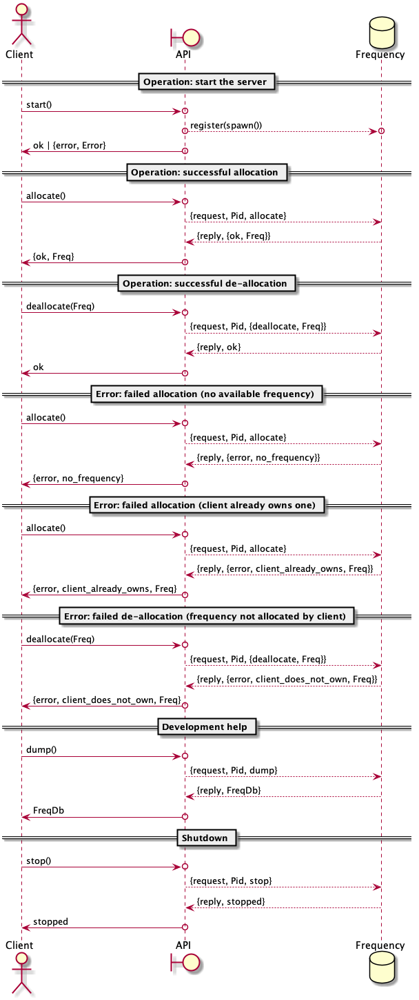

============================================================
 Exercise 4 - A Frequency Server with a functional interface
============================================================

:Home page: https://github.com/pierre-rouleau/trying-erlang
:Time-stamp: <2020-07-08 22:40:01, updated by Pierre Rouleau>

This page describes work related to the `exercise 4`_, the second exercise of the
second week of the course `Concurrent Programming in Erlang`_.

.. _exercise 4: https://www.futurelearn.com/courses/concurrent-programming-erlang/3/steps/488342
.. _Concurrent Programming in Erlang: https://www.futurelearn.com/courses/concurrent-programming-erlang/

.. contents::  **Table Of Contents**
.. sectnum::

..
   -----------------------------------------------------------------------------

A Functional Interface for the Frequency Server
===============================================

Adding a functional interface to the server is relatively simple: add
functions that will be called by the client(s) and will hold the code we used
to execute explicitly inside the shell before.  This will **hide** the complexity
of the protocol but mainly will **decouple** the implementation from the *use* of
the code: it will provide a stable *API* while allowing future internal
modifications that would not affect the *user's* code.

Hopefully, we can also reduce the `semantic gap`_ between our user's thinking and
the ideas and concepts our API provides.

.. _semantic gap: https://en.wikipedia.org/wiki/Semantic_gap

..
   -----------------------------------------------------------------------------

Version 1 - Adding a functional interface to the frequency server
-----------------------------------------------------------------

This starts from my final version of example 3 frequency server code,
`e3/v3/frequency.erl`_ then adds the functional layer, like presented in the
course: the ``allocate`` and ``deallocate`` functions that are now part of the
API are now meant to be called by the users' code.

.. _e3/v3/frequency.erl: ../e3/v3/frequency.erl

Sequence Diagram
~~~~~~~~~~~~~~~~

The graphical representation of this is:

Source Code
~~~~~~~~~~~

:code file: `e4/v1/frequency.erl`_

.. _e4/v1/frequency.erl: v1/frequency.erl

Here's the code:

.. code:: erlang

    %%%  Concurrent Programming In Erlang -- The University of Kent / FutureLearn
    %%%  Exercise  : https://www.futurelearn.com/courses/concurrent-programming-erlang/3/steps/488342
    %%%  - Enhancing the frequency server with a functional interface
    %%%
    %%% Last Modified Time-stamp: <2020-07-08 22:08:15, updated by Pierre Rouleau>
    %% -----------------------------------------------------------------------------

    %% What's New
    %% ----------
    %% - Providing a functional interface to the requests:
    %%   - allocate()
    %%   - deallocate(Freq)
    %%   - dump()
    %%   - stop()
    %%

    %% Supported Transactions
    %% ----------------------
    %%
    %% Here's the representation of the supported transactions:
    %%
    %% @startuml
    %%
    %% actor Client
    %% boundary API
    %% database Frequency
    %%
    %% == Operation: start the server ==
    %% Client ->o API : start()
    %% API    o-->o Frequency : register(spawn())
    %% Client <-o API : ok | {error, Error}
    %%
    %% == Operation: successful allocation ==
    %%
    %% Client ->o API : allocate()
    %% API --> Frequency : {request, Pid, allocate}
    %% API <-- Frequency : {reply, {ok, Freq}}
    %% Client <-o API : {ok, Freq}
    %%
    %% == Operation: successful de-allocation ==
    %%
    %% Client ->o API: deallocate(Freq)
    %% API    --> Frequency : {request, Pid, {deallocate, Freq}}
    %% API    <-- Frequency : {reply, ok}
    %% Client <-o  API : ok
    %%
    %%
    %% == Error: failed allocation (no available frequency) ==
    %%
    %% Client ->o API : allocate()
    %% API    --> Frequency : {request, Pid, allocate}
    %% API    <-- Frequency : {reply, {error, no_frequency}}
    %% Client <-o API : {error, no_frequency}
    %%
    %% == Error: failed allocation (client already owns one) ==
    %%
    %% Client ->o API : allocate()
    %% API --> Frequency : {request, Pid, allocate}
    %% API <-- Frequency : {reply, {error, client_already_owns, Freq}}
    %% Client <-o API : {error, client_already_owns, Freq}
    %%
    %% == Error: failed de-allocation (frequency not allocated by client) ==
    %%
    %% Client ->o API : deallocate(Freq)
    %% API --> Frequency : {request, Pid, {deallocate, Freq}}
    %% API <-- Frequency : {reply, {error, client_does_not_own, Freq}}
    %% Client <-o  API : {error, client_does_not_own, Freq}
    %%
    %% == Development help ==
    %%
    %% Client ->o API : dump()
    %% API --> Frequency : {request, Pid, dump}
    %% API <-- Frequency : {reply, FreqDb}
    %% Client <-o API : FreqDb
    %%
    %% == Shutdown ==
    %%
    %% Client ->o API: stop()
    %% API --> Frequency : {request, Pid, stop}
    %% API <-- Frequency : {reply, stopped}
    %% Client <-o API : stopped
    %%
    %% @enduml

    %% Server Functional State / Data Model
    %% ------------------------------------
    %% The server functional state is:
    %% - a pair of lists {Free, Allocated}
    %%   - Free := a list of frequency integers
    %%   - Allocated: a list of {Freq, UserPid}
    %%
    %% Db access functions:
    %% - allocate/2   : Allocate any frequency  for Client
    %% - deallocate/3 : de-allocate client owned frequency
    %%   - is_owner/2 : predicate: return {true, Freq} if Client owns a frequency,
    %%                  False otherwise.
    %%   - owns/3     : predicate: return true if Client owns a specific frequency.

    -module(frequency).
    -export([start/0, init/0, allocate/0, deallocate/1, dump/0, stop/0]).

    %% Data Model:
    %%    FreqDb := {free:[integer], allocated:[{integer, pid}]}

    %%% Public API

    %% start/0 : start the server
    %%  return : ok | {error, Error}
    start() ->
        case register(frequency, spawn(frequency, init, [])) of
            true ->  ok;
            Error -> {error, Error}
        end.

    %% allocate/0 : allocate a frequency for the caller's process
    %%     return :  {ok, Freq} | {error, client_already_own, Freq{}
    allocate() ->
        frequency ! {request, self(), allocate},
        receive {reply, Reply} ->
                 Reply
        end.

    %% deallocate/1 : deallocate a specified frequency that should have
    %%                already have been allocated by the caller's process.
    %%       return : ok | {error, client_does_not_own, Freq}
    deallocate(Freq) ->
        frequency ! {request, self(), {deallocate, Freq}},
        receive {reply, Reply} ->
                Reply
        end.

    %% dump/0 : return internal database data (should really be debug only)
    dump() ->
        frequency ! {request, self(), dump},
        receive {reply, FreqDb} ->
                FreqDb
        end.

    % stop/0 : stop the frequency server
    stop() ->
        frequency ! {request, self(), stop},
        receive {reply, Reply} ->
                Reply
        end.

    %%% Internal process logic

    init() ->
        FreqDb = {get_frequencies(), []},
        loop(FreqDb).

    loop(FreqDb) ->
        receive
            {request, Pid, allocate} ->
                {NewFreqDb, Result} = allocate(FreqDb, Pid),
                Pid ! {reply, Result},
                loop(NewFreqDb);
            {request, Pid, {deallocate, Freq}}  ->
                {NewFreqDb, Result} = deallocate(FreqDb, Freq, Pid),
                Pid! {reply, Result},
                loop(NewFreqDb);
            {request, Pid, dump} ->
                Pid! {reply, FreqDb},
                loop(FreqDb);
            {request, Pid, stop} ->
                Pid! {reply, stopped}
        end.

    %% Frequency 'Database' management functions.

    %% allocate/2: FreqDb, ClientPid
    %% allocate a frequency for ClientPid.  Allow 1 frequency per Client.
    %% Return:  {FreqDb, Reply}
    %%   1) when all frequencies are allocated (none free)
    allocate({[], Allocated}, _Pid) ->
        { {[], Allocated},
          {error, no_frequency} };
    %%   2) with some available frequency/ies
    allocate({[Freq|Free], Allocated}, Pid) ->
        case is_owner(Allocated, Pid) of
            false ->    { {Free, [{Freq, Pid} | Allocated]},
                          {ok, Freq} };
            {true, OwnedFreq} -> { {[Freq|Free], Allocated},
                                   {error, client_already_owns, OwnedFreq} }
        end.

    %% deallocate/3 : FreqDb, Freq, Pid
    %% de-allocate client owned frequency
    %% Return:  {FreqDb, Reply}
    deallocate({Free, Allocated}, Freq, Pid) ->
        case owns(Allocated, Freq, Pid) of
            true ->     NewAllocated = lists:keydelete(Freq, 1, Allocated),
                        { {[Freq|Free], NewAllocated},
                          ok };
            false ->    { {Free, Allocated},
                          {error, client_does_not_own, Freq} }
        end.

    %%% Database verification

    %% is_owner/2 : Allocated, ClientPid
    %% Return {true, Freq} when ClientPid already owns a frequency, false otherwise.
    is_owner([], _ClientPid) -> false;
    is_owner([{Freq, ClientPid} | _AllocatedTail], ClientPid) -> {true, Freq};
    is_owner([_Head | Tail], ClientPid) -> is_owner(Tail, ClientPid).

    %% owns/3 : Allocated, Freq, ClientPid
    %% Return true when ClientPid owns Freq, false otherwise.
    owns([], _Freq, _ClientPid) -> false;
    owns([{Freq, ClientPid} | _AllocatedTail], Freq, ClientPid) -> true;
    owns([_Head | Tail], Freq, ClientPid) -> owns(Tail, Freq, ClientPid).

    %%% Database initialization

    get_frequencies() ->
        [10,11,12,13,14,15].

    %% -----------------------------------------------------------------------------

A session using the server via its functional interface
~~~~~~~~~~~~~~~~~~~~~~~~~~~~~~~~~~~~~~~~~~~~~~~~~~~~~~~

It's now much easier to use the server.  Here's a session:

.. code:: erlang

Erlang/OTP 22 [erts-10.7.2] [source] [64-bit] [smp:8:8] [ds:8:8:10] [async-threads:1] [hipe] [dtrace]

    Eshell V10.7.2  (abort with ^G)
    1> c("/Users/roup/doc/trying-erlang/exercises/e4/v1/frequency", [{outdir, "/Users/roup/doc/trying-erlang/exercises/e4/v1/"}]).
    c("/Users/roup/doc/trying-erlang/exercises/e4/v1/frequency", [{outdir, "/Users/roup/doc/trying-erlang/exercises/e4/v1/"}]).
    {ok,frequency}
    2> frequency:start().
    ok
    3> frequency:dump().
    {[10,11,12,13,14,15],[]}
    4> frequency:deallocate(42).
    {error,client_does_not_own,42}
    5> frequency:deallocate(3.14159).
    {error,client_does_not_own,3.14159}
    6> frequency:dump().
    {[10,11,12,13,14,15],[]}
    7> frequency:allocate().
    {ok,10}
    8> frequency:allocate().
    {error,client_already_owns,10}
    9> frequency:deallocate(42).
    {error,client_does_not_own,42}
    10> frequency:dump().
    {[11,12,13,14,15],[{10,<0.79.0>}]}
    11> self().
    <0.79.0>
    12> frequency:deallocate(10).
    ok
    13> frequency:deallocate(10).
    {error,client_does_not_own,10}
    14> frquency:dump().
    ** exception error: undefined function frquency:dump/0
    15> frequency:dump().
    {[10,11,12,13,14,15],[]}
    16> frequency:stop().
    stopped
    17> frequency:allocate().
    ** exception error: bad argument
         in function  frequency:allocate/0 (/Users/roup/doc/trying-erlang/exercises/e4/v1/frequency.erl, line 120)
    18>

Looking Back
~~~~~~~~~~~~

Although the code provides a cleaner functional interface, I still need to
include ``init/0`` in the list of functions that are made available
externally.  Hopefully, there is a way this can be removed.  At the moment I
don't see it.

Also, when I first tried using this code it hung when I tried to deallocate on
a empty database.  The error was trivial: instead of sending a message with
the ``request`` atom, I was sending the ``reply`` one.
Of course the server was ignoring the message and the call never received a
reply.

Yes it's possible to put a timeout.  That's potentially defensive programming
here and not necessarily a good thing either, waiting to mask other issues.
My point is that a simple typo in the message atom in a
large program can cause a deadlock like this.  I know that unit testing,
Quickcheck and all sorts of techniques can help here, but people do make
typing mistakes and it be nice to be able to perform static analysis to detect
these things.
I wonder if the ML-like BEAM languages are getting close from being
production ready.  That could help here.

Another thing. It would be nice if it was possible to create a macro in the
shell, to help increase efficiency in issuing commands, specially when you end
up having to retype large parts of code.  Yes history helps, but compared to
other shells, the Erlang shell seems under-powered.  Maybe I need to spend
more time reading the complete `Erlang shell man page`_.

*Emacs Related Note*

When I `installed Erlang`_ I `installed the Erlang Man pages`_ accessible from
the command line. I'm using them inside Emacs.  With Emacs I can quickly
search the man pages: Emacs command allows me to list the available man pages.
One thing I might want to do is find a way to restrict the available man pages
to only Erlang man pages.  This way when I list all available man pages I
would only see the Erlang related ones.

.. _Erlang shell man page: https://erlang.org/doc/man/shell.html
.. _installed Erlang: https://github.com/pierre-rouleau/about-erlang#installing-erlang
.. _installed the Erlang Man pages: https://github.com/pierre-rouleau/about-erlang#manual-installation-of-erlang-otp-documentation-and-man-files

-----------------------------------------------------------------------------
