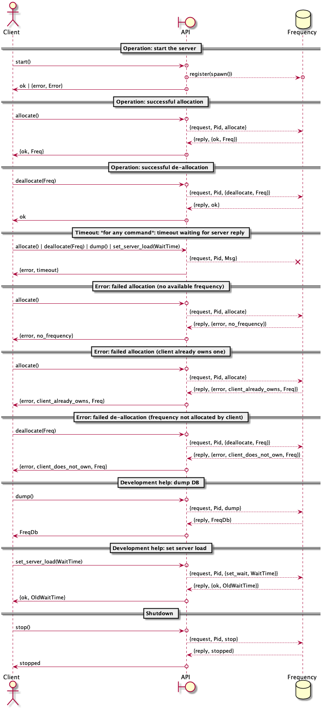

============================================================
 Exercise 4 - A Frequency Server with a functional interface
============================================================

:Home page: https://github.com/pierre-rouleau/trying-erlang
:Time-stamp: <2020-07-18 11:19:30, updated by Pierre Rouleau>

This page describes work related to the `exercise 4`_, the second exercise of the
second week of the course `Concurrent Programming in Erlang`_.

.. _exercise 4: https://www.futurelearn.com/courses/concurrent-programming-erlang/3/steps/488342
.. _Concurrent Programming in Erlang: https://www.futurelearn.com/courses/concurrent-programming-erlang/

.. contents::  **Table Of Contents**
.. sectnum::

..
   -----------------------------------------------------------------------------

A Functional Interface for the Frequency Server
===============================================

Adding a functional interface to the server is relatively simple: add
functions that will be called by the client(s) and will hold the code we used
to execute explicitly inside the shell before.  This will **hide** the complexity
of the protocol but mainly will **decouple** the implementation from the *use* of
the code: it will provide a stable *API* while allowing future internal
modifications that would not affect the *user's* code.

Hopefully, we can also reduce the `semantic gap`_ between our user's thinking and
the ideas and concepts our API provides.

.. _semantic gap: https://en.wikipedia.org/wiki/Semantic_gap

..
   -----------------------------------------------------------------------------

Version 1 - Adding a functional interface to the frequency server
-----------------------------------------------------------------

This starts from my final version of example 3 frequency server code,
`e3/v3/frequency.erl`_ then adds the functional layer, like presented in the
course: the ``allocate`` and ``deallocate`` functions that are now part of the
API are now meant to be called by the users' code.

.. _e3/v3/frequency.erl: ../e3/v3/frequency.erl

Sequence Diagram
~~~~~~~~~~~~~~~~

The user now calls:

- frequency:start()
- frequency:allocate()
- frequency: deallocate(Freq)
- frequency:stop()

and I added, for debugging,

- frequency:dump().

The transactions using a specific protocol is hidden from the user's code.

The graphical representation of this is, where I represent the *API* as the
boundary of the system which the user interacts with:

.. image:: v1/res/fs-v1.png

Source Code
~~~~~~~~~~~

:code file: `e4/v1/frequency.erl`_

.. _e4/v1/frequency.erl: v1/frequency.erl

Here's the code:

.. code:: erlang

    %%%  Concurrent Programming In Erlang -- The University of Kent / FutureLearn
    %%%  Exercise  : https://www.futurelearn.com/courses/concurrent-programming-erlang/3/steps/488342
    %%%  - Enhancing the frequency server with a functional interface
    %%%
    %%% Last Modified Time-stamp: <2020-07-08 22:08:15, updated by Pierre Rouleau>
    %% -----------------------------------------------------------------------------

    %% What's New
    %% ----------
    %% - Providing a functional interface to the requests:
    %%   - allocate()
    %%   - deallocate(Freq)
    %%   - dump()
    %%   - stop()
    %%

    %% Supported Transactions
    %% ----------------------
    %%
    %% Here's the representation of the supported transactions:
    %%
    %% @startuml
    %%
    %% actor Client
    %% boundary API
    %% database Frequency
    %%
    %% == Operation: start the server ==
    %% Client ->o API : start()
    %% API    o-->o Frequency : register(spawn())
    %% Client <-o API : ok | {error, Error}
    %%
    %% == Operation: successful allocation ==
    %%
    %% Client ->o API : allocate()
    %% API --> Frequency : {request, Pid, allocate}
    %% API <-- Frequency : {reply, {ok, Freq}}
    %% Client <-o API : {ok, Freq}
    %%
    %% == Operation: successful de-allocation ==
    %%
    %% Client ->o API: deallocate(Freq)
    %% API    --> Frequency : {request, Pid, {deallocate, Freq}}
    %% API    <-- Frequency : {reply, ok}
    %% Client <-o  API : ok
    %%
    %%
    %% == Error: failed allocation (no available frequency) ==
    %%
    %% Client ->o API : allocate()
    %% API    --> Frequency : {request, Pid, allocate}
    %% API    <-- Frequency : {reply, {error, no_frequency}}
    %% Client <-o API : {error, no_frequency}
    %%
    %% == Error: failed allocation (client already owns one) ==
    %%
    %% Client ->o API : allocate()
    %% API --> Frequency : {request, Pid, allocate}
    %% API <-- Frequency : {reply, {error, client_already_owns, Freq}}
    %% Client <-o API : {error, client_already_owns, Freq}
    %%
    %% == Error: failed de-allocation (frequency not allocated by client) ==
    %%
    %% Client ->o API : deallocate(Freq)
    %% API --> Frequency : {request, Pid, {deallocate, Freq}}
    %% API <-- Frequency : {reply, {error, client_does_not_own, Freq}}
    %% Client <-o  API : {error, client_does_not_own, Freq}
    %%
    %% == Development help ==
    %%
    %% Client ->o API : dump()
    %% API --> Frequency : {request, Pid, dump}
    %% API <-- Frequency : {reply, FreqDb}
    %% Client <-o API : FreqDb
    %%
    %% == Shutdown ==
    %%
    %% Client ->o API: stop()
    %% API --> Frequency : {request, Pid, stop}
    %% API <-- Frequency : {reply, stopped}
    %% Client <-o API : stopped
    %%
    %% @enduml

    %% Server Functional State / Data Model
    %% ------------------------------------
    %% The server functional state is:
    %% - a pair of lists {Free, Allocated}
    %%   - Free := a list of frequency integers
    %%   - Allocated: a list of {Freq, UserPid}
    %%
    %% Db access functions:
    %% - allocate/2   : Allocate any frequency  for Client
    %% - deallocate/3 : de-allocate client owned frequency
    %%   - is_owner/2 : predicate: return {true, Freq} if Client owns a frequency,
    %%                  False otherwise.
    %%   - owns/3     : predicate: return true if Client owns a specific frequency.

    -module(frequency).
    -export([start/0, init/0, allocate/0, deallocate/1, dump/0, stop/0]).

    %% Data Model:
    %%    FreqDb := {free:[integer], allocated:[{integer, pid}]}

    %%% Public API

    %% start/0 : start the server
    %%  return : ok | {error, Error}
    start() ->
        case register(frequency, spawn(frequency, init, [])) of
            true ->  ok;
            Error -> {error, Error}
        end.

    %% allocate/0 : allocate a frequency for the caller's process
    %%     return :  {ok, Freq} | {error, client_already_own, Freq{}
    allocate() ->
        frequency ! {request, self(), allocate},
        receive {reply, Reply} ->
                 Reply
        end.

    %% deallocate/1 : deallocate a specified frequency that should have
    %%                already have been allocated by the caller's process.
    %%       return : ok | {error, client_does_not_own, Freq}
    deallocate(Freq) ->
        frequency ! {request, self(), {deallocate, Freq}},
        receive {reply, Reply} ->
                Reply
        end.

    %% dump/0 : return internal database data (should really be debug only)
    dump() ->
        frequency ! {request, self(), dump},
        receive {reply, FreqDb} ->
                FreqDb
        end.

    % stop/0 : stop the frequency server
    stop() ->
        frequency ! {request, self(), stop},
        receive {reply, Reply} ->
                Reply
        end.

    %%% Internal process logic

    init() ->
        FreqDb = {get_frequencies(), []},
        loop(FreqDb).

    loop(FreqDb) ->
        receive
            {request, Pid, allocate} ->
                {NewFreqDb, Result} = allocate(FreqDb, Pid),
                Pid ! {reply, Result},
                loop(NewFreqDb);
            {request, Pid, {deallocate, Freq}}  ->
                {NewFreqDb, Result} = deallocate(FreqDb, Freq, Pid),
                Pid! {reply, Result},
                loop(NewFreqDb);
            {request, Pid, dump} ->
                Pid! {reply, FreqDb},
                loop(FreqDb);
            {request, Pid, stop} ->
                Pid! {reply, stopped}
        end.

    %% Frequency 'Database' management functions.

    %% allocate/2: FreqDb, ClientPid
    %% allocate a frequency for ClientPid.  Allow 1 frequency per Client.
    %% Return:  {FreqDb, Reply}
    %%   1) when all frequencies are allocated (none free)
    allocate({[], Allocated}, _Pid) ->
        { {[], Allocated},
          {error, no_frequency} };
    %%   2) with some available frequency/ies
    allocate({[Freq|Free], Allocated}, Pid) ->
        case is_owner(Allocated, Pid) of
            false ->    { {Free, [{Freq, Pid} | Allocated]},
                          {ok, Freq} };
            {true, OwnedFreq} -> { {[Freq|Free], Allocated},
                                   {error, client_already_owns, OwnedFreq} }
        end.

    %% deallocate/3 : FreqDb, Freq, Pid
    %% de-allocate client owned frequency
    %% Return:  {FreqDb, Reply}
    deallocate({Free, Allocated}, Freq, Pid) ->
        case owns(Allocated, Freq, Pid) of
            true ->     NewAllocated = lists:keydelete(Freq, 1, Allocated),
                        { {[Freq|Free], NewAllocated},
                          ok };
            false ->    { {Free, Allocated},
                          {error, client_does_not_own, Freq} }
        end.

    %%% Database verification

    %% is_owner/2 : Allocated, ClientPid
    %% Return {true, Freq} when ClientPid already owns a frequency, false otherwise.
    is_owner([], _ClientPid) -> false;
    is_owner([{Freq, ClientPid} | _AllocatedTail], ClientPid) -> {true, Freq};
    is_owner([_Head | Tail], ClientPid) -> is_owner(Tail, ClientPid).

    %% owns/3 : Allocated, Freq, ClientPid
    %% Return true when ClientPid owns Freq, false otherwise.
    owns([], _Freq, _ClientPid) -> false;
    owns([{Freq, ClientPid} | _AllocatedTail], Freq, ClientPid) -> true;
    owns([_Head | Tail], Freq, ClientPid) -> owns(Tail, Freq, ClientPid).

    %%% Database initialization

    get_frequencies() ->
        [10,11,12,13,14,15].

    %% -----------------------------------------------------------------------------

A session using the server via its functional interface
~~~~~~~~~~~~~~~~~~~~~~~~~~~~~~~~~~~~~~~~~~~~~~~~~~~~~~~

It's now much easier to use the server.  Here's a session:

.. code:: erlang

    Erlang/OTP 22 [erts-10.7.2] [source] [64-bit] [smp:8:8] [ds:8:8:10] [async-threads:1] [hipe] [dtrace]

    Eshell V10.7.2  (abort with ^G)
    1> c("/Users/roup/doc/trying-erlang/exercises/e4/v1/frequency", [{outdir, "/Users/roup/doc/trying-erlang/exercises/e4/v1/"}]).
    c("/Users/roup/doc/trying-erlang/exercises/e4/v1/frequency", [{outdir, "/Users/roup/doc/trying-erlang/exercises/e4/v1/"}]).
    {ok,frequency}
    2> frequency:start().
    ok
    3> frequency:dump().
    {[10,11,12,13,14,15],[]}
    4> frequency:deallocate(42).
    {error,client_does_not_own,42}
    5> frequency:deallocate(3.14159).
    {error,client_does_not_own,3.14159}
    6> frequency:dump().
    {[10,11,12,13,14,15],[]}
    7> frequency:allocate().
    {ok,10}
    8> frequency:allocate().
    {error,client_already_owns,10}
    9> frequency:deallocate(42).
    {error,client_does_not_own,42}
    10> frequency:dump().
    {[11,12,13,14,15],[{10,<0.79.0>}]}
    11> self().
    <0.79.0>
    12> frequency:deallocate(10).
    ok
    13> frequency:deallocate(10).
    {error,client_does_not_own,10}
    14> frquency:dump().
    ** exception error: undefined function frquency:dump/0
    15> frequency:dump().
    {[10,11,12,13,14,15],[]}
    16> frequency:stop().
    stopped
    17> frequency:allocate().
    ** exception error: bad argument
         in function  frequency:allocate/0 (/Users/roup/doc/trying-erlang/exercises/e4/v1/frequency.erl, line 120)
    18>

Looking Back
~~~~~~~~~~~~

Although the code provides a cleaner functional interface, I still need to
include ``init/0`` in the list of functions that are made available
externally.  Hopefully, there is a way this can be removed.  At the moment I
don't see it.

Also, when I first tried using this code it hung when I tried to deallocate on
a empty database.  The error was trivial: instead of sending a message with
the ``request`` atom, I was sending the ``reply`` one.
Of course the server was ignoring the message and the call never received a
reply.

Yes it's possible to put a timeout.  That's potentially defensive programming
here and not necessarily a good thing either, waiting to mask other issues.
My point is that a simple typo in the message atom in a
large program can cause a deadlock like this.  I know that unit testing,
Quickcheck and all sorts of techniques can help here, but people do make
typing mistakes and it be nice to be able to perform static analysis to detect
these things.
I wonder if the ML-like BEAM languages (Alpaca_ and Gleam_) are getting close from being
production ready.  That could help here.

Another thing. It would be nice if it was possible to create a macro in the
shell, to help increase efficiency in issuing commands, specially when you end
up having to retype large parts of code.  Yes history helps, but compared to
other shells, the Erlang shell seems under-powered.  Maybe I need to spend
more time reading the complete `Erlang shell man page`_.

*Emacs Related Note*

When I `installed Erlang`_ I also `installed the Erlang Man pages`_ and made
them accessible from the command line, and therefore from Emacs.
Because I'm using them inside Emacs.  With Emacs I can quickly
search the man pages: Emacs command allows me to list the available man pages.
One thing I might want to do is find a way to restrict the available man pages
to only Erlang man pages.  This way when I list all available man pages I
would only see the Erlang related ones.  That's one of the things I want to do
with Emacs.  The other would be to implement quick access to local HTML
documentation for a specific [Module][:Function[:Arity]] directly from the
source code.  That might have already been done.

.. _Erlang shell man page: https://erlang.org/doc/man/shell.html
.. _installed Erlang: https://github.com/pierre-rouleau/about-erlang#installing-erlang
.. _installed the Erlang Man pages: https://github.com/pierre-rouleau/about-erlang#manual-installation-of-erlang-otp-documentation-and-man-files
.. _Alpaca: https://github.com/alpaca-lang/alpaca
.. _Gleam: https://github.com/gleam-lang/gleam

-----------------------------------------------------------------------------

Version 2- Simulating a Server Load and clearing client's mailbox
-----------------------------------------------------------------

I am now adding what is requested by the exercise:

#. the ability to clear the client's mailbox,
#. the ability for the client's API functions to timeout when waiting for a
   reply from the server, and
#. the ability to simulate a busy server by making the server sleep for some time.

I'm adding a little bit more:

- The ``clear()`` function returns the number of messaged removed from the mailbox
  and also prints each cleared message on stdout.
- A ``set_server_load()`` function which sets the server's sleep time.

I submitted a first version of that file (v2) and then found a bug in the loop
handling the reception of the set_server_load request.  I fixed it in v2.1,
but you'll have to see the file history for the changes between v2 and v2.1.

I have also updated the PlantUML diagram to represent the concept of timeout.

Note, however, that I have not added a clear in the server yet.   I want to do
this on request.  That will be my next and final step.

Sequence Diagram
~~~~~~~~~~~~~~~~

This diagram now describes the potential timeout.  Only one block is used for
all of them.

Source Code
~~~~~~~~~~~

:code file: `e4/v2/frequency.erl`_

.. _e4/v2/frequency.erl: v2/frequency.erl

Here's the code:

.. code:: erlang

    %%%  Concurrent Programming In Erlang -- The University of Kent / FutureLearn
    %%%  Exercise  : https://www.futurelearn.com/courses/concurrent-programming-erlang/3/steps/488342
    %%%  v2 - += Flushing the mailbox, adding timeout to client code
    %%%
    %%% Last Modified Time-stamp: <2020-07-10 10:57:29, updated by Pierre Rouleau>
    %% -----------------------------------------------------------------------------

    %% What's New
    %% ----------
    %% - v2.1: - Fixed a bug in loop patter for set_wait: A *new* variable must be
    %%           used for the time: ``NewWaitTime`` otherwise it patterns match
    %%           only if the wait time value does *not* change!
    %%         - Placed clear() code close to where it's used.
    %%         - Added several io:format to see the clear and delay activities.
    %% - v2: instrument for simulating server loading:
    %%       - client can now timeout after CLIENT_RX_TIMEOUT (set to 1 second via a macro)
    %%       - Data structure change: FreDb has a TestData field.
    %%         For now it holds a tuple of 1 tagged value: {sleep_period, integer}
    %%         identifying the time the server should sleep before each receive
    %%         to let message accumulate in its mailbox.
    %%       - Added new debug command/message: set_server_load/1 which identifies
    %%         how long the server should sleep.
    %%       - Added clear/0 which clears a mailbox, printing each message removed
    %%         and returning the number of cleared message.
    %%         It is called by the client before the client sends a new request,
    %%         to flush previous un-processed replies.
    %% - v1: Providing a functional interface to the requests:
    %%       - allocate()
    %%       - deallocate(Freq)
    %%       - dump()
    %%       - stop()
    %%

    %% Supported Transactions
    %% ----------------------
    %%
    %% Here's the representation of the supported transactions:
    %%
    %% @startuml
    %%
    %% actor Client
    %% boundary API
    %% database Frequency
    %%
    %% == Operation: start the server ==
    %% Client ->o API : start()
    %% API    o-->o Frequency : register(spawn())
    %% Client <-o API : ok | {error, Error}
    %%
    %% == Operation: successful allocation ==
    %%
    %% Client ->o API : allocate()
    %% API --> Frequency : {request, Pid, allocate}
    %% API <-- Frequency : {reply, {ok, Freq}}
    %% Client <-o API : {ok, Freq}
    %%
    %% == Operation: successful de-allocation ==
    %%
    %% Client ->o API: deallocate(Freq)
    %% API    --> Frequency : {request, Pid, {deallocate, Freq}}
    %% API    <-- Frequency : {reply, ok}
    %% Client <-o  API : ok
    %%
    %%
    %% == Timeout: *for any command*: timeout waiting for server reply ==
    %%
    %% Client -> API : allocate() | deallocate(Freq) | dump() | set_server_load(WaitTime)
    %% API  -->x Frequency : {request, Pid, Msg}
    %% Client <- API : {error, timeout}
    %%
    %% == Error: failed allocation (no available frequency) ==
    %%
    %% Client ->o API : allocate()
    %% API    --> Frequency : {request, Pid, allocate}
    %% API    <-- Frequency : {reply, {error, no_frequency}}
    %% Client <-o API : {error, no_frequency}
    %%
    %% == Error: failed allocation (client already owns one) ==
    %%
    %% Client ->o API : allocate()
    %% API --> Frequency : {request, Pid, allocate}
    %% API <-- Frequency : {reply, {error, client_already_owns, Freq}}
    %% Client <-o API : {error, client_already_owns, Freq}
    %%
    %% == Error: failed de-allocation (frequency not allocated by client) ==
    %%
    %% Client ->o API : deallocate(Freq)
    %% API --> Frequency : {request, Pid, {deallocate, Freq}}
    %% API <-- Frequency : {reply, {error, client_does_not_own, Freq}}
    %% Client <-o  API : {error, client_does_not_own, Freq}
    %%
    %% == Development help: dump DB ==
    %%
    %% Client ->o API : dump()
    %% API --> Frequency : {request, Pid, dump}
    %% API <-- Frequency : {reply, FreqDb}
    %% Client <-o API : FreqDb
    %%
    %% == Development help: set server load ==
    %%
    %% Client ->o API : set_server_load(WaitTime)
    %% API --> Frequency : {request, Pid, {set_wait, WaitTime}}
    %% API <-- Frequency : {reply, {ok, OldWaitTime}}
    %% Client <-o API : {ok, OldWaitTime}
    %%
    %% == Shutdown ==
    %%
    %% Client ->o API: stop()
    %% API --> Frequency : {request, Pid, stop}
    %% API <-- Frequency : {reply, stopped}
    %% Client <-o API : stopped
    %%
    %% @enduml

    %% Server Functional State / Data Model
    %% ------------------------------------
    %% The server functional state is:
    %% - a pair of lists {Free, Allocated}
    %%   - Free := a list of frequency integers
    %%   - Allocated: a list of {Freq, UserPid}
    %%
    %% Db access functions:
    %% - allocate/2   : Allocate any frequency  for Client
    %% - deallocate/3 : de-allocate client owned frequency
    %%   - is_owner/2 : predicate: return {true, Freq} if Client owns a frequency,
    %%                  False otherwise.
    %%   - owns/3     : predicate: return true if Client owns a specific frequency.

    -module(frequency).
    -export([start/0, init/0, allocate/0, deallocate/1, dump/0, set_server_load/1,  stop/0]).

    %% Data Model:
    %%    FreqDb := { free     : [integer],
    %%                allocated: [{integer, pid}]
    %%                test     : sleep_period := integer
    %%               }

    %%% Public API
    -define(CLIENT_RX_TIMEOUT, 3000).   % Timeout for client waiting for server reply.

    %% start/0 : start the server
    %%  return : ok | {error, Error}
    start() ->
        case register(frequency, spawn(frequency, init, [])) of
            true ->  ok;
            Error -> {error, Error}
        end.

    %% allocate/0 : allocate a frequency for the caller's process
    %%     return :  {ok, Freq} | {error, client_already_own, Freq{}
    allocate() ->
        Cleared = clear(),
        io:format("set_server_load(): cleared: ~w~n", [Cleared]),
        frequency ! {request, self(), allocate},
        receive {reply, Reply} ->
                 Reply
        after ?CLIENT_RX_TIMEOUT -> {error, timeout}
        end.

    %% deallocate/1 : deallocate a specified frequency that should have
    %%                already have been allocated by the caller's process.
    %%       return : ok | {error, client_does_not_own, Freq}
    deallocate(Freq) ->
        Cleared = clear(),
        io:format("set_server_load(): cleared: ~w~n", [Cleared]),
        frequency ! {request, self(), {deallocate, Freq}},
        receive {reply, Reply} ->
                Reply
        after ?CLIENT_RX_TIMEOUT -> {error, timeout}
        end.

    %% dump/0 : return internal database data (should really be debug only)
    dump() ->
        Cleared = clear(),
        io:format("set_server_load(): cleared: ~w~n", [Cleared]),
        frequency ! {request, self(), dump},
        receive {reply, FreqDb} ->
                FreqDb
        after ?CLIENT_RX_TIMEOUT -> {error, timeout}
        end.

    %% set_server_load/1 : WaitTime (in milliseconds)
    %% Return: ok | {error, timeout}
    set_server_load(WaitTime) ->
        io:format("set_server_load()~n"),
        Cleared = clear(),
        io:format("set_server_load(): cleared: ~w~n", [Cleared]),
        frequency ! {request, self(), {set_wait, WaitTime}},
        io:format("set_server_load(): request sent, waiting for reply~n"),
        receive {reply, Reply} ->
                Reply
        after ?CLIENT_RX_TIMEOUT -> {error, timeout}
        end.

    % stop/0 : stop the frequency server
    stop() ->
        clear(),
        frequency ! {request, self(), stop},
        receive {reply, Reply} ->
                Reply
        after ?CLIENT_RX_TIMEOUT -> {error, timeout}
        end.

    %%% Client API utility function

    %% clear/0: clear the mailbox
    %%   return: number of cleared messages.
    %%   side effect: prints each cleared message on stdout.

    clear() -> clear(0).
    clear(ClearCount) ->
        receive
            Msg ->
                io:format("Cleared Message: ~w~n", [Msg]),
                clear(ClearCount + 1)
        after 0 -> {ok, ClearCount}
        end.

    %% -----------------------------------------------------------------------------
    %%% Server - Internal process logic

    init() ->
        FreqDb = {get_frequencies(), [], {sleep_period, 0}},
        loop(FreqDb).

    loop(FreqDb) ->
        {_Allocated, _Free, {sleep_period, WaitTime}} = FreqDb,
        io:format("loop: waiting ~w...~n", [WaitTime]),
        timer:sleep(WaitTime),
        io:format("loop: receiving~n"),
        receive
            {request, Pid, allocate} ->
                {NewFreqDb, Result} = allocate(FreqDb, Pid),
                Pid ! {reply, Result},
                loop(NewFreqDb);
            {request, Pid, {deallocate, Freq}}  ->
                {NewFreqDb, Result} = deallocate(FreqDb, Freq, Pid),
                Pid! {reply, Result},
                loop(NewFreqDb);
            {request, Pid, dump} ->
                Pid! {reply, FreqDb},
                loop(FreqDb);
            {request, Pid, {set_wait, NewWaitTime}} ->
                io:format("loop received set_wait(~w)~n", [NewWaitTime]),
                {NewFreqDb, Result} = set_wait(FreqDb, NewWaitTime),
                Pid ! {reply, Result},
                loop(NewFreqDb);
            {request, Pid, stop} ->
                Pid! {reply, stopped};
            Msg  ->
                io:format("loop: rx unexpected: ~w~n", [Msg]),
                loop(FreqDb)
        end.

    %% Frequency 'Database' management functions.

    %% allocate/2: FreqDb, ClientPid
    %% allocate a frequency for ClientPid.  Allow 1 frequency per Client.
    %% Return:  {FreqDb, Reply}
    %%   1) when all frequencies are allocated (none free)
    allocate({[], Allocated, TestData}, _Pid) ->
        { {[], Allocated, TestData},
          {error, no_frequency} };
    %%   2) with some available frequency/ies
    allocate({[Freq|Free], Allocated, TestData}, Pid) ->
        case is_owner(Allocated, Pid) of
            false ->    { {Free, [{Freq, Pid} | Allocated], TestData},
                          {ok, Freq} };
            {true, OwnedFreq} -> { {[Freq|Free], Allocated, TestData},
                                   {error, client_already_owns, OwnedFreq} }
        end.

    %% deallocate/3 : FreqDb, Freq, Pid
    %% de-allocate client owned frequency
    %% Return:  {FreqDb, Reply}
    deallocate({Free, Allocated, TestData}, Freq, Pid) ->
        case owns(Allocated, Freq, Pid) of
            true ->     NewAllocated = lists:keydelete(Freq, 1, Allocated),
                        { {[Freq|Free], NewAllocated, TestData},
                          ok };
            false ->    { {Free, Allocated, TestData},
                          {error, client_does_not_own, Freq} }
        end.

    %% set_wait/2: FreqDb, WaitTime
    %% set server sleep time to WaitTime
    %% Return: {FreqDb, {ok, OldWaitTime}}
    set_wait({Free, Allocated, {sleep_period, OldWaitTime}}, WaitTime) ->
        {{Free, Allocated, {sleep_period, WaitTime}}, {ok, OldWaitTime}}.

    %%% Database verification

    %% is_owner/2 : Allocated, ClientPid
    %% Return {true, Freq} when ClientPid already owns a frequency, false otherwise.
    is_owner([], _ClientPid) -> false;
    is_owner([{Freq, ClientPid} | _AllocatedTail], ClientPid) -> {true, Freq};
    is_owner([_Head | Tail], ClientPid) -> is_owner(Tail, ClientPid).

    %% owns/3 : Allocated, Freq, ClientPid
    %% Return true when ClientPid owns Freq, false otherwise.
    owns([], _Freq, _ClientPid) -> false;
    owns([{Freq, ClientPid} | _AllocatedTail], Freq, ClientPid) -> true;
    owns([_Head | Tail], Freq, ClientPid) -> owns(Tail, Freq, ClientPid).

    %%% Database initialization

    get_frequencies() ->
        [10,11,12,13,14,15].

    %% -----------------------------------------------------------------------------

..
   -----------------------------------------------------------------------------

Erlang Session with the functional server with load simulation
~~~~~~~~~~~~~~~~~~~~~~~~~~~~~~~~~~~~~~~~~~~~~~~~~~~~~~~~~~~~~~

The session is shown below.  It's a bit verbose because of the ``io:format``
calls in various locations.  Note also that I made a typo at some point.  This
had *surprising* impact!  I discuss it in the next Looking Back section.

.. code:: erlang

    Erlang/OTP 22 [erts-10.7.2] [source] [64-bit] [smp:8:8] [ds:8:8:10] [async-threads:1] [hipe] [dtrace]

    Eshell V10.7.2  (abort with ^G)
    1> c("/Users/roup/doc/trying-erlang/exercises/e4/v2/frequency", [{outdir, "/Users/roup/doc/trying-erlang/exercises/e4/v2/"}]).
    c("/Users/roup/doc/trying-erlang/exercises/e4/v2/frequency", [{outdir, "/Users/roup/doc/trying-erlang/exercises/e4/v2/"}]).
    {ok,frequency}
    2> frequency:start().
    loop: waiting 0...
    ok
    loop: receiving
    3> frequency:dump().
    set_server_load(): cleared: {ok,0}
    loop: waiting 0...
    loop: receiving
    {[10,11,12,13,14,15],[],{sleep_period,0}}
    4> setlf().
    ** exception error: undefined shell command setlf/0
    5> self().
    <0.89.0>
    6> frequency:allocate().
    set_server_load(): cleared: {ok,0}
    loop: waiting 0...
    loop: receiving
    {ok,10}
    7> frequency:dump().
    set_server_load(): cleared: {ok,0}
    loop: waiting 0...
    loop: receiving
    {[11,12,13,14,15],[{10,<0.89.0>}],{sleep_period,0}}
    8> frequency:deallocate(10).
    set_server_load(): cleared: {ok,0}
    loop: waiting 0...
    loop: receiving
    ok
    9> frequency:dump().
    set_server_load(): cleared: {ok,0}
    loop: waiting 0...
    loop: receiving
    {[10,11,12,13,14,15],[],{sleep_period,0}}
    10> frwquency:set_server_load(10 * 1000).
    ** exception error: undefined function frwquency:set_server_load/1
    11> frequency:set_server_load(10 * 1000).
    set_server_load()
    set_server_load(): cleared: {ok,0}
    set_server_load(): request sent, waiting for reply
    loop received set_wait(10000)
    loop: waiting 10000...
    {ok,0}
    12> frequency:dump().
    set_server_load(): cleared: {ok,0}
    {error,timeout}
    loop: receiving
    loop: waiting 10000...
    loop: receiving
    13> frequency:allocate().
    Cleared Message: {reply,{[10,11,12,13,14,15],[],{sleep_period,10000}}}
    set_server_load(): cleared: {ok,1}
    loop: waiting 10000...
    {ok,10}
    loop: receiving
    14> frequency:dump().
    set_server_load(): cleared: {ok,0}
    loop: waiting 10000...
    {[11,12,13,14,15],[{10,<0.96.0>}],{sleep_period,10000}}
    loop: receiving
    15> self().
    <0.96.0>
    16> invalid_command().
    ** exception error: undefined shell command invalid_command/0
    17> self().
    <0.103.0>
    18> frequency:allocate().
    set_server_load(): cleared: {ok,0}
    loop: waiting 10000...
    {ok,11}
    loop: receiving
    19> frequency:dump().
    set_server_load(): cleared: {ok,0}
    loop: waiting 10000...
    {[12,13,14,15],
     [{11,<0.103.0>},{10,<0.96.0>}],
     {sleep_period,10000}}
    loop: receiving
    20> frequency:deallocate(10).
    set_server_load(): cleared: {ok,0}
    loop: waiting 10000...
    {error,client_does_not_own,10}
    21> frequency:deallocate(10).
    set_server_load(): cleared: {ok,0}
    {error,timeout}
    22> frequency:deallocate(10).
    set_server_load(): cleared: {ok,0}
    loop: receiving
    loop: waiting 10000...
    {error,client_does_not_own,10}
    loop: receiving
    loop: waiting 10000...
    23> frequency:deallocate(10).
    Cleared Message: {reply,{error,client_does_not_own,10}}
    set_server_load(): cleared: {ok,1}
    {error,timeout}
    loop: receiving
    loop: waiting 10000...
    loop: receiving
    24> frequency:dump().
    Cleared Message: {reply,{error,client_does_not_own,10}}
    set_server_load(): cleared: {ok,1}
    loop: waiting 10000...
    {[12,13,14,15],
     [{11,<0.103.0>},{10,<0.96.0>}],
     {sleep_period,10000}}
    loop: receiving
    25> frequency:deallocate(11).
    set_server_load(): cleared: {ok,0}
    loop: waiting 10000...
    ok
    loop: receiving
    26> frequency:dump().
    set_server_load(): cleared: {ok,0}
    loop: waiting 10000...
    {[11,12,13,14,15],[{10,<0.96.0>}],{sleep_period,10000}}
    loop: receiving
    27> frequency:stop().
    stopped
    28>

Looking Back
~~~~~~~~~~~~

With this exercise I came up with the observations listed in the following
sub-sections.

An easy way to create bugs in Erlang
^^^^^^^^^^^^^^^^^^^^^^^^^^^^^^^^^^^^

Learning a new programming language is also learning the way you create
bugs. In Erlang one way to create a bug is to use the name of an already bound
variable inside the pattern match part of a message you want to receive.
That's exactly what I did when I introduced a command to set the sleep delay to
impose to the server!  When I first tried the code I was not able to change
the delay.  Everything seems to be OK, I was staring at the code where the
message was sent, the code where the message was received and everything
looked good! Look:

The ``set_server_load/1`` code has the following statement that sends the
message:

.. code:: erlang

    frequency ! {request, self(), {set_wait, WaitTime}},

Inside ``loop/0`` I added the following:

.. code:: erlang

        {request, Pid, {set_wait, WaitTime}} ->
            io:format("loop received set_wait(~w)~n", [WaitTime]),
            {FreqDb, Result} = set_wait(FreqDb, WaitTime),
            Pid ! {reply, Result},
            loop(FreqDb);

Everything matched!  I'm a bad typist, so I used my editor to ensure that
everything, really everything matched.  And it matched! Arghh!

Then, ah... I just looked at ``WaitTime``...
It just so happens that I named the function argument ``WaitTime``:

.. code:: erlang

    %% set_server_load/1 : WaitTime (in milliseconds)
    %% Return: ok | {error, timeout}
    set_server_load(WaitTime) ->

I had thought about using ``NewWaitTime`` in the code for the loop reception,
but then I was lazy and just used the shorter one.  Laziness is a nice
computer science concept, but I was just lazy and it costed me more than the
time it would have taken to do it right.  The correct ``loop/0`` code is:

.. code:: erlang

        {request, Pid, {set_wait, NewWaitTime}} ->
            io:format("loop received set_wait(~w)~n", [NewWaitTime]),
            {NewFreqDb, Result} = set_wait(FreqDb, NewWaitTime),
            Pid ! {reply, Result},
            loop(NewFreqDb);

Having ``WaitTime`` in the pattern meant that the server would only receive
messages requesting to change the sleep time to the same value it had!

One thing I did looking into this problem was to add a catch-all message
reception inside the server loop.  This is defensive programming but that's
also what confirmed to me the message was received in the mailbox but not
caught by the pattern.  I'll have to remember to remove it: I'll probably want
to fill the mailbox just be sending invalid messages!

An error caught in the shell creates another process!
^^^^^^^^^^^^^^^^^^^^^^^^^^^^^^^^^^^^^^^^^^^^^^^^^^^^^

I had read that. I heard it too. In the course. *When an exception is caught
and handled in the shell, the shell process died and a new one takes it
place*.

A **new shell**, with a **new PID**!

An when you mistype something, what happens?  An exception is thrown and
caught and **the shell PID changes**!

And I was wondering what was wrong with my code not being able to de-allocate
a previously allocated frequency!  Well I allocated the frequency, then I made
a typo, that killed the shell process I had, and I got a new one with a new
PID.  So when I was sending a request to the frequency server asking to
de-allocate the frequency it was telling me that by process did not allocate
it in the first place!

The code was right.  The use of the Erlang shell continues to provide
surprises.

..
   -----------------------------------------------------------------------------

Version 3 - A Loaded Server that can clear its mailbox
------------------------------------------------------

My previous version is using clear/0 to clear the mailbox of the client side.
That is useful when the caller is expecting that its calls will not block his
process for too long.  Note, however, that because the server is *not*
clearing its mailbox, it will get old replies, process them and send the reply
back to the client that is no longer expecting it.  Because the client code
clears its mailbox in **each** of the functional interface calls, its OK but
messages will accumulate inside the server still.

By placing a ``clear/0`` call inside the server's loop/0 just before the
receive statement, the simulation will be closer to reality: the clients
requests that have timed-out at the client side will effectively be ignored by
the server.

All that is needed is to add the call to ``clear/0`` before the receive
statement.  And where should it be relative to the call to ``timer:sleep/1``?

If I call ``clear/0`` before the ``timer:sleep/1`` that gives me the time to fill it
up again while the server sleeping.  In fact that's why I did not put the
clear call in the server in the first place: I wanted to let the messages
accumulate in the server mailbox.

But one thing was missing.  I would have liked to **confirm** the messages
accumulated inside the server's mailbox.  I'm sure there must be a function
call to get the number of messages in the mailbox.

To find it I had to "*google*" it because I did not find anything in the
*erlang* man page (the page for the BIFs).  It was there though: it's
`process_info/2`_ with a ``message_queue_len`` for the second argument.

.. _process_info/2: https://erlang.org/doc/man/erlang.html#process_info-2

So I added a call to this first in the v3 code before completing it.  Just so
I could see the count growing up.  I added the show_mailbox() for that and I
made it public to use it for the client-side.

Erlang Code
~~~~~~~~~~~

:code file: `e4/v3/frequency.erl`_  (final code)

.. _e4/v3/frequency.erl: v3/frequency.erl

The difference between v2.1 and v3 is shown here:

.. code:: diff

    diff -u /Users/roup/doc/trying-erlang/exercises/e4/v2/frequency.erl /Users/roup/doc/trying-erlang/exercises/e4/v3/frequency.erl
    --- /Users/roup/doc/trying-erlang/exercises/e4/v2/frequency.erl	2020-07-10 10:57:29.000000000 -0400
    +++ /Users/roup/doc/trying-erlang/exercises/e4/v3/frequency.erl	2020-07-10 13:11:38.000000000 -0400
    @@ -1,12 +1,16 @@
     %%%  Concurrent Programming In Erlang -- The University of Kent / FutureLearn
     %%%  Exercise  : https://www.futurelearn.com/courses/concurrent-programming-erlang/3/steps/488342
    -%%%  v2 - += Flushing the mailbox, adding timeout to client code
    +%%%  v3 - += Showing size of mailbox
     %%%
    -%%% Last Modified Time-stamp: <2020-07-10 10:57:29, updated by Pierre Rouleau>
    +%%% Last Modified Time-stamp: <2020-07-10 13:11:38, updated by Pierre Rouleau>
     %% -----------------------------------------------------------------------------

     %% What's New
     %% ----------
    +%% - v3:  - Added show_mailbox() public function to show number of messages
    +%%          accumulating in the server and also to see the ones accumulating in the client.
    +%%        - Removed other debug prints I introduced in v2.1.
    +%%        - Removed the catch-all Msg reception in loop/0 I used for debugging v2.
     %% - v2.1: - Fixed a bug in loop patter for set_wait: A *new* variable must be
     %%           used for the time: ``NewWaitTime`` otherwise it patterns match
     %%           only if the wait time value does *not* change!
    @@ -128,7 +132,7 @@

     -module(frequency).
    --export([start/0, init/0, allocate/0, deallocate/1, dump/0, set_server_load/1,  stop/0]).
    +-export([start/0, init/0, allocate/0, deallocate/1, dump/0, set_server_load/1, show_mailbox/0, stop/0]).

     %% Data Model:
     %%    FreqDb := { free     : [integer],
    @@ -188,7 +192,6 @@
         Cleared = clear(),
         io:format("set_server_load(): cleared: ~w~n", [Cleared]),
         frequency ! {request, self(), {set_wait, WaitTime}},
    -    io:format("set_server_load(): request sent, waiting for reply~n"),
         receive {reply, Reply} ->
                 Reply
         after ?CLIENT_RX_TIMEOUT -> {error, timeout}
    @@ -227,9 +230,7 @@

     loop(FreqDb) ->
         {_Allocated, _Free, {sleep_period, WaitTime}} = FreqDb,
    -    io:format("loop: waiting ~w...~n", [WaitTime]),
         timer:sleep(WaitTime),
    -    io:format("loop: receiving~n"),
         receive
             {request, Pid, allocate} ->
                 {NewFreqDb, Result} = allocate(FreqDb, Pid),
    @@ -243,18 +244,15 @@
                 Pid! {reply, FreqDb},
                 loop(FreqDb);
             {request, Pid, {set_wait, NewWaitTime}} ->
    -            io:format("loop received set_wait(~w)~n", [NewWaitTime]),
                 {NewFreqDb, Result} = set_wait(FreqDb, NewWaitTime),
                 Pid ! {reply, Result},
                 loop(NewFreqDb);
             {request, Pid, stop} ->
    -            Pid! {reply, stopped};
    -        Msg  ->
    -            io:format("loop: rx unexpected: ~w~n", [Msg]),
    -            loop(FreqDb)
    +            Pid! {reply, stopped}
         end.

    +
     %% Frequency 'Database' management functions.

     %% allocate/2: FreqDb, ClientPid
    @@ -292,6 +290,12 @@
         {{Free, Allocated, {sleep_period, WaitTime}}, {ok, OldWaitTime}}.

    +%% show_mailbox_size/0 : print and return process mailbox size on stdout
    +show_mailbox() ->
    +    {message_queue_len, MsgCount} = process_info(self(), message_queue_len),
    +    io:format("Size of ~w mailbox: ~w~n", [self(), MsgCount]),
    +              MsgCount.
    +

     %%% Database verification

    Diff finished.  Fri Jul 10 13:14:45 2020

..
   -----------------------------------------------------------------------------

One More Modification : show_mailbox/1
~~~~~~~~~~~~~~~~~~~~~~~~~~~~~~~~~~~~~~

To be able to look at the server mail ox size I created show_mailbox/2 which
takes the Pid as argument:

.. code:: diff

    diff --git a/exercises/e4/v3/frequency.erl b/exercises/e4/v3/frequency.erl
    index 32e5642..03709b0 100644
    --- a/exercises/e4/v3/frequency.erl
    +++ b/exercises/e4/v3/frequency.erl
    @@ -2,7 +2,7 @@
     %%%  Exercise  : https://www.futurelearn.com/courses/concurrent-programming-erlang/3/steps/488342
     %%%  v3 - += Showing size of mailbox
     %%%
    -%%% Last Modified Time-stamp: <2020-07-10 13:11:38, updated by Pierre Rouleau>
    +%%% Last Modified Time-stamp: <2020-07-10 13:59:31, updated by Pierre Rouleau>
     %% -----------------------------------------------------------------------------

     %% What's New
    @@ -132,7 +132,15 @@

     -module(frequency).
    --export([start/0, init/0, allocate/0, deallocate/1, dump/0, set_server_load/1, show_mailbox/0, stop/0]).
    +-export([ start/0
    +        , init/0
    +        , allocate/0
    +        , deallocate/1
    +        , dump/0
    +        , set_server_load/1
    +        , show_mailbox/0
    +        , show_mailbox/1
    +        , stop/0]).

     %% Data Model:
     %%    FreqDb := { free     : [integer],
    @@ -290,12 +298,15 @@ set_wait({Free, Allocated, {sleep_period, OldWaitTime}}, WaitTime) ->
         {{Free, Allocated, {sleep_period, WaitTime}}, {ok, OldWaitTime}}.

    -%% show_mailbox_size/0 : print and return process mailbox size on stdout
    +%% show_mailbox/0 : print and return process mailbox size on stdout
     show_mailbox() ->
    -    {message_queue_len, MsgCount} = process_info(self(), message_queue_len),
    -    io:format("Size of ~w mailbox: ~w~n", [self(), MsgCount]),
    -              MsgCount.
    +    show_mailbox(self()).

    +%% show_mailbox/1 : print and return process mailbox size on stdout
    +show_mailbox(Pid) ->
    +    {message_queue_len, MsgCount} = process_info(Pid, message_queue_len),
    +    io:format("Size of ~w mailbox: ~w~n", [self(), MsgCount]),
    +    MsgCount.

     %%% Database verification

Session using show_mailbox
~~~~~~~~~~~~~~~~~~~~~~~~~~

With the last v3 code (now submitted), I used the shell again to confirm that
messages accumulate in the server and to watch them coming back in the client.

Of course, I mis-typed several thing, creating a new shell process with its
new PID.

.. code:: erlang

    Erlang/OTP 22 [erts-10.7.2] [source] [64-bit] [smp:8:8] [ds:8:8:10] [async-threads:1] [hipe] [dtrace]

    Eshell V10.7.2  (abort with ^G)
    1> c("/Users/roup/doc/trying-erlang/exercises/e4/v3/frequency", [{outdir, "/Users/roup/doc/trying-erlang/exercises/e4/v3/"}]).
    c("/Users/roup/doc/trying-erlang/exercises/e4/v3/frequency", [{outdir, "/Users/roup/doc/trying-erlang/exercises/e4/v3/"}]).
    {ok,frequency}
    2> frequency:start().
    ok
    3> self().
    <0.79.0>
    4> whereis(frequency).
    <0.86.0>
    5> frequency:dump().
    set_server_load(): cleared: {ok,0}
    {[10,11,12,13,14,15],[],{sleep_period,0}}
    6> show_mailbox().
    ** exception error: undefined shell command show_mailbox/0
    7> self().
    <0.91.0>
    8> frequency:show_mailbox().
    Size of <0.91.0> mailbox: 0
    0
    9> frequency:show_mailbox(whereis(frequency)).
    Size of <0.91.0> mailbox: 0
    0
    10> frequency ! "an invalid message".
    "an invalid message"
    11> frequency ! {request, slef(), invalid}.
    ** exception error: undefined shell command slef/0
    12> self().
    <0.97.0>
    13> S = self().
    <0.97.0>
    14> frequency ! {request, S, invalid}.
    {request,<0.97.0>,invalid}
    15> frequency:show_mailbox(whereis(frequency)).
    Size of <0.97.0> mailbox: 2
    2
    16> frequency:show_mailbox().
    Size of <0.97.0> mailbox: 0
    0
    17> frequency:dump().
    set_server_load(): cleared: {ok,0}
    {[10,11,12,13,14,15],[],{sleep_period,0}}
    18> frequency:set_server_load(30 * 1000).
    set_server_load()
    set_server_load(): cleared: {ok,0}
    {ok,0}
    19>
    19> frequency:allocate().
    set_server_load(): cleared: {ok,0}
    {error,timeout}
    20> frequency:dump().
    set_server_load(): cleared: {ok,0}
    {error,timeout}
    21> frequency:allocate().
    Cleared Message: {reply,{ok,10}}
    set_server_load(): cleared: {ok,1}
    {error,timeout}
    22> frequency:show_mailbox(whereis(frequency)).
    Size of <0.97.0> mailbox: 3
    3
    23> frequency:show_mailbox(whereis(frequency)).
    Size of <0.97.0> mailbox: 3
    3
    24> frequency:show_mailbox(whereis(frequency)).
    Size of <0.97.0> mailbox: 3
    3
    25> frequency:show_mailbox(whereis(frequency)).
    Size of <0.97.0> mailbox: 2
    2
    26> frequency:show_mailbox().
    Size of <0.97.0> mailbox: 2
    2
    27> flush().
    Shell got {reply,{[11,12,13,14,15],[{10,<0.97.0>}],{sleep_period,30000}}}
    Shell got {reply,{error,client_already_owns,10}}
    ok
    28> frequency:set_server_load(1 * 1000).
    set_server_load()
    set_server_load(): cleared: {ok,0}
    {ok,30000}
    29>
    29> frequency:dump().
    set_server_load(): cleared: {ok,0}
    {[11,12,13,14,15],[{10,<0.97.0>}],{sleep_period,1000}}
    30> frequency:allocate().
    set_server_load(): cleared: {ok,0}
    {error,client_already_owns,10}
    31> frequency:deallocate().
    ** exception error: undefined function frequency:deallocate/0
    32> self().
    <0.118.0>
    33> frequency:stop().
    stopped
    34>

Clearing Server mailbox in frequency:loop
~~~~~~~~~~~~~~~~~~~~~~~~~~~~~~~~~~~~~~~~~

The last step is to get the server to clear its mailbox. It's done like the clients:
before receiving.  But, unlike the server, the clients do tot sleep.  The
location of the clear in the server is before the sleep, to give me some time
in filling up the server mailbox.

The difference with the previous version of the source code is:

.. code:: diff

    diff --git a/exercises/e4/v3/frequency.erl b/exercises/e4/v3/frequency.erl
    index 03709b0..12f76a6 100644
    --- a/exercises/e4/v3/frequency.erl
    +++ b/exercises/e4/v3/frequency.erl
    @@ -2,12 +2,14 @@
     %%%  Exercise  : https://www.futurelearn.com/courses/concurrent-programming-erlang/3/steps/488342
     %%%  v3 - += Showing size of mailbox
     %%%
    -%%% Last Modified Time-stamp: <2020-07-10 13:59:31, updated by Pierre Rouleau>
    +%%% Last Modified Time-stamp: <2020-07-10 14:40:00, updated by Pierre Rouleau>
     %% -----------------------------------------------------------------------------

     %% What's New
     %% ----------
    -%% - v3:  - Added show_mailbox() public function to show number of messages
    +%% - v3.1: - Added a clear in the server's loop, before the timer:sleep call so I can
    +%%           get several messages to accumulate.
    +%% - v3:  - Added show_mailbox() public functions to show number of messages
     %%          accumulating in the server and also to see the ones accumulating in the client.
     %%        - Removed other debug prints I introduced in v2.1.
     %%        - Removed the catch-all Msg reception in loop/0 I used for debugging v2.
    @@ -237,8 +239,14 @@ init() ->
         loop(FreqDb).

     loop(FreqDb) ->
    +    %% extract WaitTime
         {_Allocated, _Free, {sleep_period, WaitTime}} = FreqDb,
    +    %% clear the mailbox
    +    Cleared = clear(),
    +    io:format("frequency loop(): cleared: ~w~n", [Cleared]),
    +    %% simulate a server load
         timer:sleep(WaitTime),
    +    %% normal processing
         receive
             {request, Pid, allocate} ->
                 {NewFreqDb, Result} = allocate(FreqDb, Pid),

And the final code is...
~~~~~~~~~~~~~~~~~~~~~~~~

With the ``io:format`` statements that a half-decent job of logging the
internal activity...

:code file: `e4/v3/frequency.erl`_

.. code:: erlang

    %%%  Concurrent Programming In Erlang -- The University of Kent / FutureLearn
    %%%  Exercise  : https://www.futurelearn.com/courses/concurrent-programming-erlang/3/steps/488342
    %%%  v3 - += Showing size of mailbox, clearing mailbox at client & server,
    %%%          imposing server load by sleeping+
    %%%
    %%% Last Modified Time-stamp: <2020-07-10 15:22:45, updated by Pierre Rouleau>
    %% -----------------------------------------------------------------------------

    %% What's New
    %% ----------
    %% - v3.1: - Added a clear in the server's loop, before the timer:sleep call so I can
    %%           get several messages to accumulate.
    %% - v3:  - Added show_mailbox() public functions to show number of messages
    %%          accumulating in the server and also to see the ones accumulating in the client.
    %%        - Removed other debug prints I introduced in v2.1.
    %%        - Removed the catch-all Msg reception in loop/0 I used for debugging v2.
    %% - v2.1: - Fixed a bug in loop patter for set_wait: A *new* variable must be
    %%           used for the time: ``NewWaitTime`` otherwise it patterns match
    %%           only if the wait time value does *not* change!
    %%         - Placed clear() code close to where it's used.
    %%         - Added several io:format to see the clear and delay activities.
    %% - v2: instrument for simulating server loading:
    %%       - client can now timeout after CLIENT_RX_TIMEOUT (set to 1 second via a macro)
    %%       - Data structure change: FreDb has a TestData field.
    %%         For now it holds a tuple of 1 tagged value: {sleep_period, integer}
    %%         identifying the time the server should sleep before each receive
    %%         to let message accumulate in its mailbox.
    %%       - Added new debug command/message: set_server_load/1 which identifies
    %%         how long the server should sleep.
    %%       - Added clear/0 which clears a mailbox, printing each message removed
    %%         and returning the number of cleared message.
    %%         It is called by the client before the client sends a new request,
    %%         to flush previous un-processed replies.
    %% - v1: Providing a functional interface to the requests:
    %%       - allocate()
    %%       - deallocate(Freq)
    %%       - dump()
    %%       - stop()
    %%

    %% Supported Transactions
    %% ----------------------
    %%
    %% Here's the representation of the supported transactions:
    %%
    %% @startuml
    %%
    %% actor Client
    %% boundary API
    %% database Frequency
    %%
    %% == Operation: start the server ==
    %% Client ->o API : start()
    %% API    o-->o Frequency : register(spawn())
    %% Client <-o API : ok | {error, Error}
    %%
    %% == Operation: successful allocation ==
    %%
    %% Client ->o API : allocate()
    %% API --> Frequency : {request, Pid, allocate}
    %% API <-- Frequency : {reply, {ok, Freq}}
    %% Client <-o API : {ok, Freq}
    %%
    %% == Operation: successful de-allocation ==
    %%
    %% Client ->o API: deallocate(Freq)
    %% API    --> Frequency : {request, Pid, {deallocate, Freq}}
    %% API    <-- Frequency : {reply, ok}
    %% Client <-o  API : ok
    %%
    %%
    %% == Timeout: *for any command*: timeout waiting for server reply ==
    %%
    %% Client -> API : allocate() | deallocate(Freq) | dump() | set_server_load(WaitTime)
    %% API  -->x Frequency : {request, Pid, Msg}
    %% Client <- API : {error, timeout}
    %%
    %% == Error: failed allocation (no available frequency) ==
    %%
    %% Client ->o API : allocate()
    %% API    --> Frequency : {request, Pid, allocate}
    %% API    <-- Frequency : {reply, {error, no_frequency}}
    %% Client <-o API : {error, no_frequency}
    %%
    %% == Error: failed allocation (client already owns one) ==
    %%
    %% Client ->o API : allocate()
    %% API --> Frequency : {request, Pid, allocate}
    %% API <-- Frequency : {reply, {error, client_already_owns, Freq}}
    %% Client <-o API : {error, client_already_owns, Freq}
    %%
    %% == Error: failed de-allocation (frequency not allocated by client) ==
    %%
    %% Client ->o API : deallocate(Freq)
    %% API --> Frequency : {request, Pid, {deallocate, Freq}}
    %% API <-- Frequency : {reply, {error, client_does_not_own, Freq}}
    %% Client <-o  API : {error, client_does_not_own, Freq}
    %%
    %% == Development help: dump DB ==
    %%
    %% Client ->o API : dump()
    %% API --> Frequency : {request, Pid, dump}
    %% API <-- Frequency : {reply, FreqDb}
    %% Client <-o API : FreqDb
    %%
    %% == Development help: set server load ==
    %%
    %% Client ->o API : set_server_load(WaitTime)
    %% API --> Frequency : {request, Pid, {set_wait, WaitTime}}
    %% API <-- Frequency : {reply, {ok, OldWaitTime}}
    %% Client <-o API : {ok, OldWaitTime}
    %%
    %% == Shutdown ==
    %%
    %% Client ->o API: stop()
    %% API --> Frequency : {request, Pid, stop}
    %% API <-- Frequency : {reply, stopped}
    %% Client <-o API : stopped
    %%
    %% @enduml

    %% Server Functional State / Data Model
    %% ------------------------------------
    %% The server functional state is:
    %% - a pair of lists {Free, Allocated}
    %%   - Free := a list of frequency integers
    %%   - Allocated: a list of {Freq, UserPid}
    %%
    %% Db access functions:
    %% - allocate/2   : Allocate any frequency  for Client
    %% - deallocate/3 : de-allocate client owned frequency
    %%   - is_owner/2 : predicate: return {true, Freq} if Client owns a frequency,
    %%                  False otherwise.
    %%   - owns/3     : predicate: return true if Client owns a specific frequency.

    -module(frequency).
    -export([ start/0
            , init/0
            , allocate/0
            , deallocate/1
            , dump/0
            , set_server_load/1
            , show_mailbox/0
            , show_mailbox/1
            , stop/0]).

    %% Data Model:
    %%    FreqDb := { free     : [integer],
    %%                allocated: [{integer, pid}]
    %%                test     : sleep_period := integer
    %%               }

    %%% Public API
    -define(CLIENT_RX_TIMEOUT, 3000).   % Timeout for client waiting for server reply.

    %% start/0 : start the server
    %%  return : ok | {error, Error}
    start() ->
        case register(frequency, spawn(frequency, init, [])) of
            true ->  ok;
            Error -> {error, Error}
        end.

    %% allocate/0 : allocate a frequency for the caller's process
    %%     return :  {ok, Freq} | {error, client_already_own, Freq{}
    allocate() ->
        Cleared = clear(),
        io:format("set_server_load(): cleared: ~w~n", [Cleared]),
        frequency ! {request, self(), allocate},
        receive {reply, Reply} ->
                 Reply
        after ?CLIENT_RX_TIMEOUT -> {error, timeout}
        end.

    %% deallocate/1 : deallocate a specified frequency that should have
    %%                already have been allocated by the caller's process.
    %%       return : ok | {error, client_does_not_own, Freq}
    deallocate(Freq) ->
        Cleared = clear(),
        io:format("set_server_load(): cleared: ~w~n", [Cleared]),
        frequency ! {request, self(), {deallocate, Freq}},
        receive {reply, Reply} ->
                Reply
        after ?CLIENT_RX_TIMEOUT -> {error, timeout}
        end.

    %% dump/0 : return internal database data (should really be debug only)
    dump() ->
        Cleared = clear(),
        io:format("set_server_load(): cleared: ~w~n", [Cleared]),
        frequency ! {request, self(), dump},
        receive {reply, FreqDb} ->
                FreqDb
        after ?CLIENT_RX_TIMEOUT -> {error, timeout}
        end.

    %% set_server_load/1 : WaitTime (in milliseconds)
    %% Return: ok | {error, timeout}
    set_server_load(WaitTime) ->
        io:format("set_server_load()~n"),
        Cleared = clear(),
        io:format("set_server_load(): cleared: ~w~n", [Cleared]),
        frequency ! {request, self(), {set_wait, WaitTime}},
        receive {reply, Reply} ->
                Reply
        after ?CLIENT_RX_TIMEOUT -> {error, timeout}
        end.

    % stop/0 : stop the frequency server
    stop() ->
        clear(),
        frequency ! {request, self(), stop},
        receive {reply, Reply} ->
                Reply
        after ?CLIENT_RX_TIMEOUT -> {error, timeout}
        end.

    %%% Client API utility function

    %% clear/0: clear the mailbox
    %%   return: number of cleared messages.
    %%   side effect: prints each cleared message on stdout.

    clear() -> clear(0).
    clear(ClearCount) ->
        receive
            Msg ->
                io:format("Cleared Message: ~w~n", [Msg]),
                clear(ClearCount + 1)
        after 0 -> {ok, ClearCount}
        end.

    %% -----------------------------------------------------------------------------
    %%% Server - Internal process logic

    init() ->
        FreqDb = {get_frequencies(), [], {sleep_period, 0}},
        loop(FreqDb).

    loop(FreqDb) ->
        %% extract WaitTime
        {_Allocated, _Free, {sleep_period, WaitTime}} = FreqDb,
        %% clear the mailbox
        Cleared = clear(),
        io:format("frequency loop(): cleared: ~w~n", [Cleared]),
        %% simulate a server load
        timer:sleep(WaitTime),
        %% normal processing
        receive
            {request, Pid, allocate} ->
                {NewFreqDb, Result} = allocate(FreqDb, Pid),
                Pid ! {reply, Result},
                loop(NewFreqDb);
            {request, Pid, {deallocate, Freq}}  ->
                {NewFreqDb, Result} = deallocate(FreqDb, Freq, Pid),
                Pid! {reply, Result},
                loop(NewFreqDb);
            {request, Pid, dump} ->
                Pid! {reply, FreqDb},
                loop(FreqDb);
            {request, Pid, {set_wait, NewWaitTime}} ->
                {NewFreqDb, Result} = set_wait(FreqDb, NewWaitTime),
                Pid ! {reply, Result},
                loop(NewFreqDb);
            {request, Pid, stop} ->
                Pid! {reply, stopped}
        end.

    %% Frequency 'Database' management functions.

    %% allocate/2: FreqDb, ClientPid
    %% allocate a frequency for ClientPid.  Allow 1 frequency per Client.
    %% Return:  {FreqDb, Reply}
    %%   1) when all frequencies are allocated (none free)
    allocate({[], Allocated, TestData}, _Pid) ->
        { {[], Allocated, TestData},
          {error, no_frequency} };
    %%   2) with some available frequency/ies
    allocate({[Freq|Free], Allocated, TestData}, Pid) ->
        case is_owner(Allocated, Pid) of
            false ->    { {Free, [{Freq, Pid} | Allocated], TestData},
                          {ok, Freq} };
            {true, OwnedFreq} -> { {[Freq|Free], Allocated, TestData},
                                   {error, client_already_owns, OwnedFreq} }
        end.

    %% deallocate/3 : FreqDb, Freq, Pid
    %% de-allocate client owned frequency
    %% Return:  {FreqDb, Reply}
    deallocate({Free, Allocated, TestData}, Freq, Pid) ->
        case owns(Allocated, Freq, Pid) of
            true ->     NewAllocated = lists:keydelete(Freq, 1, Allocated),
                        { {[Freq|Free], NewAllocated, TestData},
                          ok };
            false ->    { {Free, Allocated, TestData},
                          {error, client_does_not_own, Freq} }
        end.

    %% set_wait/2: FreqDb, WaitTime
    %% set server sleep time to WaitTime
    %% Return: {FreqDb, {ok, OldWaitTime}}
    set_wait({Free, Allocated, {sleep_period, OldWaitTime}}, WaitTime) ->
        {{Free, Allocated, {sleep_period, WaitTime}}, {ok, OldWaitTime}}.

    %% show_mailbox/0 : print and return process mailbox size on stdout
    show_mailbox() ->
        show_mailbox(self()).

    %% show_mailbox/1 : print and return process mailbox size on stdout
    show_mailbox(Pid) ->
        {message_queue_len, MsgCount} = process_info(Pid, message_queue_len),
        io:format("Size of ~w mailbox: ~w~n", [self(), MsgCount]),
        MsgCount.

    %%% Database verification

    %% is_owner/2 : Allocated, ClientPid
    %% Return {true, Freq} when ClientPid already owns a frequency, false otherwise.
    is_owner([], _ClientPid) -> false;
    is_owner([{Freq, ClientPid} | _AllocatedTail], ClientPid) -> {true, Freq};
    is_owner([_Head | Tail], ClientPid) -> is_owner(Tail, ClientPid).

    %% owns/3 : Allocated, Freq, ClientPid
    %% Return true when ClientPid owns Freq, false otherwise.
    owns([], _Freq, _ClientPid) -> false;
    owns([{Freq, ClientPid} | _AllocatedTail], Freq, ClientPid) -> true;
    owns([_Head | Tail], Freq, ClientPid) -> owns(Tail, Freq, ClientPid).

    %%% Database initialization

    get_frequencies() ->
        [10,11,12,13,14,15].

    %% -----------------------------------------------------------------------------

Trying it with the Erlang Shell
~~~~~~~~~~~~~~~~~~~~~~~~~~~~~~~

Here's the session with the Erlang shell, non-touched with all of the typos
that force a re-spawn of the shell.

It's a long one. I sent several invalid messages to the server to see it
accumulate in its mailbox and also to see them cleared automatically.

Since both the client functions and the server loop print to stdout, the lines
are sometimes intermingled. It seems that Erlang treats a line output as a
critical section because the content of lines themselves are not affected,
just their order.

.. code:: erlang

    Erlang/OTP 22 [erts-10.7.2] [source] [64-bit] [smp:8:8] [ds:8:8:10] [async-threads:1] [hipe] [dtrace]

    Eshell V10.7.2  (abort with ^G)
    1> c("/Users/roup/doc/trying-erlang/exercises/e4/v3/frequency", [{outdir, "/Users/roup/doc/trying-erlang/exercises/e4/v3/"}]).
    c("/Users/roup/doc/trying-erlang/exercises/e4/v3/frequency", [{outdir, "/Users/roup/doc/trying-erlang/exercises/e4/v3/"}]).
    {ok,frequency}
    2> S = self().
    <0.79.0>
    3> F=frequency.
    frequency
    4> whereis(F).
    undefined
    5> F:start().
    frequency loop(): cleared: {ok,0}
    ok
    6> whereis(F).
    <0.89.0>
    7> F:dump().
    set_server_load(): cleared: {ok,0}
    frequency loop(): cleared: {ok,0}
    {[10,11,12,13,14,15],[],{sleep_period,0}}
    8> F:allocate().
    set_server_load(): cleared: {ok,0}
    frequency loop(): cleared: {ok,0}
    {ok,10}
    9> F:dump().
    set_server_load(): cleared: {ok,0}
    frequency loop(): cleared: {ok,0}
    {[11,12,13,14,15],[{10,<0.79.0>}],{sleep_period,0}}
    10> F ! 42.
    42
    11> F ! "the meaning of life".
    "the meaning of life"
    12> F:show_mailbox().
    Size of <0.79.0> mailbox: 0
    0
    13> F:show_mailbox(whereis(F)).
    Size of <0.79.0> mailbox: 2
    2
    14> F:set_server_load(30 * 1000).
    set_server_load()
    set_server_load(): cleared: {ok,0}
    Cleared Message: 42
    Cleared Message: [116,104,101,32,109,101,97,110,105,110,103,32,111,102,32,108,105,102,101]
    {ok,0}
    frequency loop(): cleared: {ok,2}
    15> F ! 43.
    43
    16> F ! 44.
    44
    17> F:show_mailbox(whereis(F)).
    Size of <0.79.0> mailbox: 2
    2
    18> F:allocate().
    set_server_load(): cleared: {ok,0}
    Cleared Message: 43
    Cleared Message: 44
    {error,client_already_owns,10}
    frequency loop(): cleared: {ok,2}
    19> F:allocate().
    set_server_load(): cleared: {ok,0}
    {error,timeout}
    20> F:allocate().
    set_server_load(): cleared: {ok,0}
    {error,timeout}
    21> F ! 45.
    45
    22> F:allocate().
    set_server_load(): cleared: {ok,0}
    {error,timeout}
    Cleared Message: {request,<0.79.0>,allocate}
    Cleared Message: 45
    Cleared Message: {request,<0.79.0>,allocate}
    frequency loop(): cleared: {ok,3}
    23> F:dump().
    Cleared Message: {reply,{error,client_already_owns,10}}
    set_server_load(): cleared: {ok,1}
    {error,timeout}
    24> F:show_mailbox(whereis(F)).
    Size of <0.79.0> mailbox: 1
    1
    frequency loop(): cleared: {ok,0}
    25> F:show_mailbox(whereis(F)).
    Size of <0.79.0> mailbox: 0
    0
    26> whereis(F).
    <0.89.0>
    27> self().
    <0.79.0>
    28> F ! 1.
    1
    29> F ! 2.
    2
    30> F:show_mailbox(whereis(F)).
    Size of <0.79.0> mailbox: 2
    2
    31> F:show_mailbox().
    Size of <0.79.0> mailbox: 1
    1
    32> flush().
    Shell got {reply,{[11,12,13,14,15],[{10,<0.79.0>}],{sleep_period,30000}}}
    ok
    33> F:dump().
    set_server_load(): cleared: {ok,0}
    Cleared Message: 1
    Cleared Message: 2
    {[11,12,13,14,15],[{10,<0.79.0>}],{sleep_period,30000}}
    frequency loop(): cleared: {ok,2}
    34> F:allocate().
    set_server_load(): cleared: {ok,0}
    frequency loop(): cleared: {ok,0}
    {error,client_already_owns,10}
    35> F:allocate().
    set_server_load(): cleared: {ok,0}
    {error,timeout}
    36> F:allocate().
    set_server_load(): cleared: {ok,0}
    F:allocate().
    {error,timeout}
    37> F:allocate().
    set_server_load(): cleared: {ok,0}
    {error,timeout}
    38> F:allocate().
    set_server_load(): cleared: {ok,0}
    {error,timeout}
    39> F:show_mailbox(whereis(F)).
    Size of <0.79.0> mailbox: 4
    4
    Cleared Message: {request,<0.79.0>,allocate}
    Cleared Message: {request,<0.79.0>,allocate}
    Cleared Message: {request,<0.79.0>,allocate}
    frequency loop(): cleared: {ok,3}
    40> f:dump().
    ** exception error: undefined function f:dump/0
    41> F:fump().
    ** exception error: undefined function frequency:fump/0
    42> F:dump().
    set_server_load(): cleared: {ok,0}
    {error,timeout}
    frequency loop(): cleared: {ok,0}
    43> F:dump().
    Cleared Message: {reply,{[11,12,13,14,15],[{10,<0.79.0>}],{sleep_period,30000}}}
    set_server_load(): cleared: {ok,1}
    {error,timeout}
    44> F:allocate().
    set_server_load(): cleared: {ok,0}
    {error,timeout}
    45> F:allocate().
    set_server_load(): cleared: {ok,0}
    {error,timeout}
    Cleared Message: {request,<0.127.0>,allocate}
    Cleared Message: {request,<0.127.0>,allocate}
    frequency loop(): cleared: {ok,2}
    46> F:allocate().
    Cleared Message: {reply,{[11,12,13,14,15],[{10,<0.79.0>}],{sleep_period,30000}}}
    set_server_load(): cleared: {ok,1}
    {error,timeout}
    47> F:allocate().
    set_server_load(): cleared: {ok,0}
    {error,timeout}
    48> F:allocate().
    set_server_load(): cleared: {ok,0}
    {error,timeout}
    49> F:allocate().
    set_server_load(): cleared: {ok,0}
    {error,timeout}
    50> F:allocate().
    set_server_load(): cleared: {ok,0}
    Cleared Message: {request,<0.127.0>,allocate}
    Cleared Message: {request,<0.127.0>,allocate}
    {ok,11}
    Cleared Message: {request,<0.127.0>,allocate}
    Cleared Message: {request,<0.127.0>,allocate}
    frequency loop(): cleared: {ok,4}
    51> F:allocate().
    set_server_load(): cleared: {ok,0}
    {error,timeout}
    52> F:allocate().
    set_server_load(): cleared: {ok,0}
    {error,timeout}
    53> F:allocate().
    set_server_load(): cleared: {ok,0}
    {error,timeout}
    54> F:stop().
    Cleared Message: {request,<0.127.0>,allocate}
    Cleared Message: {request,<0.127.0>,allocate}
    {error,client_already_owns,11}
    Cleared Message: {request,<0.127.0>,stop}
    frequency loop(): cleared: {ok,3}
    55> F:stop().
    {error,timeout}
    56> F:stop().
    Cleared Message: {reply,stopped}
    ** exception error: bad argument
         in function  frequency:stop/0 (/Users/roup/doc/trying-erlang/exercises/e4/v3/frequency.erl, line 213)
    57>

Looking Back
~~~~~~~~~~~~

With the shell dying and restarting I can't help than wonder if I could just
have the server register the *name* of the shell as a client instead of its
PID to associate the frequencies.  If a client dies, and restarts, the new
client will not be able to de-allocate the frequency that was allocated by its
previous self.

Also, using io:format() as a poor mans tracing mechanism has it's limits:
lines outputted by multiple processes are intermingled.  Line content integrity
is kelp but not their order.    For a real system a better tool is needed.
I'll have to read about tracing in Erlang.  It would also be nice to use
something like syslog with the ability to see the output in real-time, ideally
filtered by processes if required.
I have used `SolarWind Kiwi Syslog server`_ in the past.  I wonder what
people use with BEAM programming languages these days.

.. _SolarWind Kiwi Syslog server: https://www.kiwisyslog.com/free-tools/kiwi-free-syslog-server

-----------------------------------------------------------------------------

Version 4
---------

Version 4 is a code refactoring:

- reduced code size using utility functions:

  - the ``call`` function that abstracts the transaction with mailbox
    clearing, sending the command and receiving the reply, handling the
    timeout,
    - ``send_X`` functions that hold the details about internal protocol:
      ``send_request`` and ``send-reply``, making it easy to identify where to
      look for protocol conventions,

- splitting of the various ``export`` statements to identify the regular API,
  the debug AI and isolate the init/0 that has to be present but is not used
  explicitly.

It also contains a `copy/paste bug`_ fix.  Erlang code can have a lot of
similar code.  And therefore is subject of this insidious and hard to detect
form of bugs: you can stare at the code and because it looks familiar you
won't see the bug. The bug was in the tracing code. But still.  A bug
incurs a cost.

.. _copy/paste bug: https://blogs.grammatech.com/the-dangers-of-copy-and-paste

The new code is in:

:code file: `e4/v4/frequency.erl`_

.. _e4/v4/frequency.erl: e4/v4/frequency.erl

The changes since last version is shown below:

.. code:: diff

    diff -u /Users/roup/doc/trying-erlang/exercises/e4/v3/frequency.erl /Users/roup/doc/trying-erlang/exercises/e4/v4/frequency.erl
    --- /Users/roup/doc/trying-erlang/exercises/e4/v3/frequency.erl	2020-07-10 15:22:45.000000000 -0400
    +++ /Users/roup/doc/trying-erlang/exercises/e4/v4/frequency.erl	2020-07-18 11:12:07.000000000 -0400
    @@ -1,42 +1,15 @@
     %%%  Concurrent Programming In Erlang -- The University of Kent / FutureLearn
     %%%  Exercise  : https://www.futurelearn.com/courses/concurrent-programming-erlang/3/steps/488342
    -%%%  v3 - += Showing size of mailbox, clearing mailbox at client & server,
    -%%%          imposing server load by sleeping+
    +%%%  v4 - += Compressed v3 code.
     %%%
    -%%% Last Modified Time-stamp: <2020-07-10 15:22:45, updated by Pierre Rouleau>
    +%%% Last Modified Time-stamp: <2020-07-18 11:12:07, updated by Pierre Rouleau>
     %% -----------------------------------------------------------------------------

     %% What's New
     %% ----------
    -%% - v3.1: - Added a clear in the server's loop, before the timer:sleep call so I can
    -%%           get several messages to accumulate.
    -%% - v3:  - Added show_mailbox() public functions to show number of messages
    -%%          accumulating in the server and also to see the ones accumulating in the client.
    -%%        - Removed other debug prints I introduced in v2.1.
    -%%        - Removed the catch-all Msg reception in loop/0 I used for debugging v2.
    -%% - v2.1: - Fixed a bug in loop patter for set_wait: A *new* variable must be
    -%%           used for the time: ``NewWaitTime`` otherwise it patterns match
    -%%           only if the wait time value does *not* change!
    -%%         - Placed clear() code close to where it's used.
    -%%         - Added several io:format to see the clear and delay activities.
    -%% - v2: instrument for simulating server loading:
    -%%       - client can now timeout after CLIENT_RX_TIMEOUT (set to 1 second via a macro)
    -%%       - Data structure change: FreDb has a TestData field.
    -%%         For now it holds a tuple of 1 tagged value: {sleep_period, integer}
    -%%         identifying the time the server should sleep before each receive
    -%%         to let message accumulate in its mailbox.
    -%%       - Added new debug command/message: set_server_load/1 which identifies
    -%%         how long the server should sleep.
    -%%       - Added clear/0 which clears a mailbox, printing each message removed
    -%%         and returning the number of cleared message.
    -%%         It is called by the client before the client sends a new request,
    -%%         to flush previous un-processed replies.
    -%% - v1: Providing a functional interface to the requests:
    -%%       - allocate()
    -%%       - deallocate(Freq)
    -%%       - dump()
    -%%       - stop()
    -%%
    +%% - v4.0: refactoring: common code placed in utility functions: call()
    +%%         is now used by all the functional interface.  Doing this identified
    +%%         *copy/paste* bugs.

     %% Supported Transactions
     %% ----------------------
    @@ -136,24 +109,29 @@

     -module(frequency).
     -export([ start/0
    -        , init/0
             , allocate/0
             , deallocate/1
    -        , dump/0
    +        , stop/0]).
    +
    +-export([ dump/0
             , set_server_load/1
             , show_mailbox/0
    -        , show_mailbox/1
    -        , stop/0]).
    +        , show_mailbox/1]).
    +
    +-export([init/0]).

    +
    +%% -----------------------------------------------------------------------------
     %% Data Model:
     %%    FreqDb := { free     : [integer],
     %%                allocated: [{integer, pid}]
     %%                test     : sleep_period := integer
     %%               }

    +-define(CLIENT_RX_TIMEOUT, 3000).   % Timeout for client waiting for server reply.

    +%% -----------------------------------------------------------------------------
     %%% Public API
    --define(CLIENT_RX_TIMEOUT, 3000).   % Timeout for client waiting for server reply.

     %% start/0 : start the server
     %%  return : ok | {error, Error}
    @@ -163,66 +141,45 @@
             Error -> {error, Error}
         end.

    +
     %% allocate/0 : allocate a frequency for the caller's process
     %%     return :  {ok, Freq} | {error, client_already_own, Freq{}
    -allocate() ->
    -    Cleared = clear(),
    -    io:format("set_server_load(): cleared: ~w~n", [Cleared]),
    -    frequency ! {request, self(), allocate},
    -    receive {reply, Reply} ->
    -             Reply
    -    after ?CLIENT_RX_TIMEOUT -> {error, timeout}
    -    end.
    +allocate() -> call(frequency, allocate).

     %% deallocate/1 : deallocate a specified frequency that should have
     %%                already have been allocated by the caller's process.
     %%       return : ok | {error, client_does_not_own, Freq}
    -deallocate(Freq) ->
    -    Cleared = clear(),
    -    io:format("set_server_load(): cleared: ~w~n", [Cleared]),
    -    frequency ! {request, self(), {deallocate, Freq}},
    -    receive {reply, Reply} ->
    -            Reply
    -    after ?CLIENT_RX_TIMEOUT -> {error, timeout}
    -    end.
    +deallocate(Freq) -> call(frequency, {deallocate, Freq}).
    +
    +%%% Debugging Public API

     %% dump/0 : return internal database data (should really be debug only)
    -dump() ->
    -    Cleared = clear(),
    -    io:format("set_server_load(): cleared: ~w~n", [Cleared]),
    -    frequency ! {request, self(), dump},
    -    receive {reply, FreqDb} ->
    -            FreqDb
    -    after ?CLIENT_RX_TIMEOUT -> {error, timeout}
    -    end.
    +dump() -> call(frequency, dump).

     %% set_server_load/1 : WaitTime (in milliseconds)
     %% Return: ok | {error, timeout}
    -set_server_load(WaitTime) ->
    -    io:format("set_server_load()~n"),
    -    Cleared = clear(),
    -    io:format("set_server_load(): cleared: ~w~n", [Cleared]),
    -    frequency ! {request, self(), {set_wait, WaitTime}},
    -    receive {reply, Reply} ->
    -            Reply
    -    after ?CLIENT_RX_TIMEOUT -> {error, timeout}
    -    end.
    +set_server_load(WaitTime) -> call(frequency, {set_wait, WaitTime}).

     % stop/0 : stop the frequency server
    -stop() ->
    -    clear(),
    -    frequency ! {request, self(), stop},
    +stop() -> call(frequency, stop).
    +
    +
    +%%% Client API utility function
    +
    +%% call/2: send message and receive reply
    +%% return: reply
    +call(Server, Msg) ->
    +    Cleared = clear(),
    +    io:format("Before sending ~w, cleared: ~w~n", [Msg, Cleared]),
    +    send_request(Server, Msg),
         receive {reply, Reply} ->
    -            Reply
    +             Reply
         after ?CLIENT_RX_TIMEOUT -> {error, timeout}
         end.

    -%%% Client API utility function
    -
     %% clear/0: clear the mailbox
     %%   return: number of cleared messages.
     %%   side effect: prints each cleared message on stdout.
    -
     clear() -> clear(0).
     clear(ClearCount) ->
         receive
    @@ -232,6 +189,9 @@
         after 0 -> {ok, ClearCount}
         end.

    +%% send_request/2: send message to server
    +send_request(Server, Msg) -> Server ! {request, self(), Msg}.
    +
     %% -----------------------------------------------------------------------------
     %%% Server - Internal process logic

    @@ -251,26 +211,30 @@
         receive
             {request, Pid, allocate} ->
                 {NewFreqDb, Result} = allocate(FreqDb, Pid),
    -            Pid ! {reply, Result},
    +            send_reply(Pid, Result),
                 loop(NewFreqDb);
             {request, Pid, {deallocate, Freq}}  ->
                 {NewFreqDb, Result} = deallocate(FreqDb, Freq, Pid),
    -            Pid! {reply, Result},
    +            send_reply(Pid, Result),
                 loop(NewFreqDb);
             {request, Pid, dump} ->
    -            Pid! {reply, FreqDb},
    +            send_reply(Pid, FreqDb),
                 loop(FreqDb);
             {request, Pid, {set_wait, NewWaitTime}} ->
                 {NewFreqDb, Result} = set_wait(FreqDb, NewWaitTime),
    -            Pid ! {reply, Result},
    +            send_reply(Pid, Result),
                 loop(NewFreqDb);
             {request, Pid, stop} ->
    -            Pid! {reply, stopped}
    +            send_reply(Pid, stopped)
         end.

    +%%% Server utility functions

    -%% Frequency 'Database' management functions.
    +send_reply(Pid, Result) -> Pid ! {reply, Result}.
    +
    +%% -----------------------------------------------------------------------------
    +%%% Frequency 'Database' management functions.

     %% allocate/2: FreqDb, ClientPid
     %% allocate a frequency for ClientPid.  Allow 1 frequency per Client.

    Diff finished.  Sat Jul 18 11:12:21 2020

Looking Back
~~~~~~~~~~~~

The morale here is that using utility code to reduce duplication is a good
thing, just as refactoring code helps detect such problems.

I will eventually be looking for tools that perform static analysis (over
Typer_ and Dialyzer_) and can
help perform code refactoring of Erlang code.

.. _Typer: http://erlang.org/doc/man/typer.html
.. _Dialyzer: http://erlang.org/doc/man/typer.html

..
   -----------------------------------------------------------------------------
